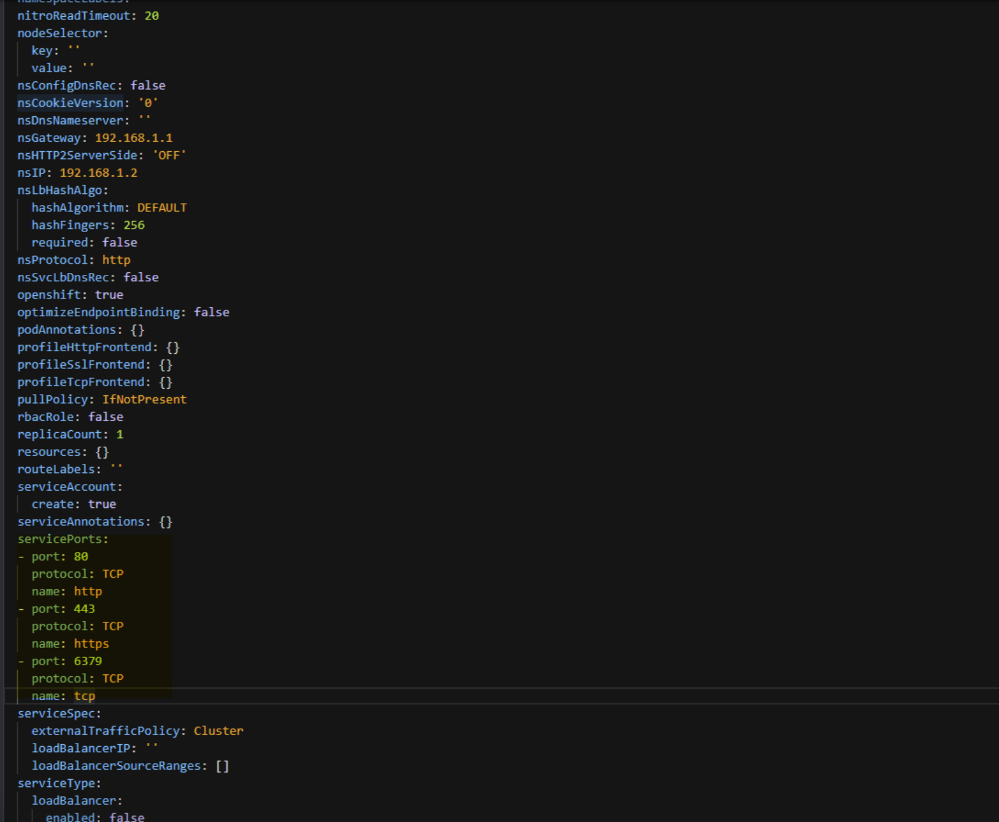

# How to load balance Ingress traffic to TCP or UDP based application

In a Kubernetes environment, an Ingress is an object that allows access to the Kubernetes services from outside the Kubernetes cluster. Standard Kubernetes Ingress resources assume that all the traffic is HTTP-based and do not cater to non-HTTP based protocols such as, TCP, TCP-SSL, and UDP. Hence, you cannot expose critical applications based on layer 7 protocols such as DNS, FTP, or LDAP using the standard Kubernetes Ingress.

NetScaler provides a solution using Ingress annotations to load balance TCP or UDP based Ingress traffic. When you specify these annotations in the Ingress resource definition, the [Citrix ingress controller](https://developer-docs.citrix.com/projects/citrix-k8s-ingress-controller/en/latest/) configures the NetScaler to load balance TCP or UDP based Ingress traffic.

You can use the following annotations in your Kubernetes Ingress resource definition to load balance the TCP or UDP based Ingress traffic:

-  `ingress.citrix.com/insecure-service-type`: The annotation enables L4 load balancing with TCP, UDP, or ANY as protocol for NetScaler.
-  `ingress.citrix.com/insecure-port`: The annotation configures the TCP port. The annotation is helpful when micro service access is required on a non-standard port. By default, port 80 is configured.

For more information about annotations, see the [annotations](../configure/annotations.md) page.

You can also use the standard Kubernetes solution of creating a `service` of `type LoadBalancer`  with NetScaler. You can find out more about [Service Type LoadBalancer in NetScaler](https://developer-docs.citrix.com/projects/citrix-k8s-ingress-controller/en/latest/network/type_loadbalancer/).

**Sample:** Ingress definition for TCP-based Ingress.

```yml
apiVersion: networking.k8s.io/v1
kind: Ingress
metadata:
  annotations:
    ingress.citrix.com/insecure-port: '6379'
    ingress.citrix.com/insecure-service-type: tcp
  name: redis-master-ingress
spec:
  defaultBackend:
    service:
      name: redis-master-pods
      port:
        number: 6379
  ingressClassName: guestbook
---
apiVersion: networking.k8s.io/v1
kind: IngressClass
metadata:
  name: guestbook
spec:
  controller: citrix.com/ingress-controller
---

```

**Sample:** Ingress definition for UDP-based Ingress. The following is a sample for Citrix ingress controller version 1.1.1:

```yml
apiVersion: networking.k8s.io/v1
kind: Ingress
metadata:
  annotations:
    ingress.citrix.com/insecure-port: "5084"
    ingress.citrix.com/insecure-service-type: "udp"
  name: udp-ingress
spec:
  defaultBackend:
    service:
      name: frontend
      port:
        name: udp-53  # Service port name defined in the service defination
```

The following is a sample service definition where the service port name is defined as `udp-53`:

```yml
apiVersion: v1
kind: Service
metadata:
  name: bind
  labels:
    app: bind
spec:
  ports:
  - name: udp-53
    port: 53
    targetPort: 53
    protocol: UDP
  selector:
    name: bind
```

**Sample:** Ingress definition for UDP-based Ingress. The following is a sample for Citrix ingress controller version 1.5.25:

```yml
apiVersion: networking.k8s.io/v1
kind: Ingress
metadata:
  annotations:
    ingress.citrix.com/insecure-port: "5084"
    ingress.citrix.com/insecure-service-type: "udp"
  name: udp-ingress
spec:
  defaultBackend:
    service:
      name: frontend
      port:
        number: 53
```

## Load balance Ingress traffic based on TCP over SSL

Citrix ingress controller provides an `'ingress.citrix.com/secure-service-type: ssl_tcp` annotation that you can use to load balance Ingress traffic based on TCP over SSL.

**Sample:** Ingress definition for TCP over SSL based Ingress.

```yml
apiVersion: networking.k8s.io/v1
kind: Ingress
metadata:
  annotations:
    ingress.citrix.com/secure-service-type: ssl_tcp
    ingress.citrix.com/secure_backend: '{"frontendcolddrinks":"True"}'
  name: colddrinks-ingress
spec:
  defaultBackend:
    service:
      name: frontend-colddrinks
      port:
        number: 443
  ingressClassName: colddrink
  tls:
  - secretName: colddrink-secret
---
apiVersion: networking.k8s.io/v1
kind: IngressClass
metadata:
  name: colddrink
spec:
  controller: citrix.com/ingress-controller
---

```

## Monitor and improve the performance of your TCP or UDP based applications

Application developers can closely monitor the health of TCP or UDP based applications through rich monitors (such as TCP-ECV, UDP-ECV) in NetScaler. The ECV (extended content validation) monitors help in checking whether the
application is returning expected content or not.

Also, the application performance can be improved by using persistence methods such as `Source IP`. You can use these NetScaler features through [Smart Annotations](../configure/annotations.md#smart-annotations) in
Kubernetes. The following is one such example:

```yml
apiVersion: networking.k8s.io/v1
kind: Ingress
metadata:
  annotations:
    ingress.citrix.com/frontend-ip: "192.168.1.1"
    ingress.citrix.com/insecure-port: "80"
    ingress.citrix.com/lbvserver: '{"mongodb-svc":{"lbmethod":"SRCIPDESTIPHASH"}}'
    ingress.citrix.com/monitor: '{"mongodbsvc":{"type":"tcp-ecv"}}'
  name: mongodb
spec:
  rules:
  - host: mongodb.beverages.com
    http:
      paths:
      - backend:
          service:
            name: mongodb-svc
            port:
              number: 80
        path: /
        pathType: Prefix
```

For more information on the different deployment options supported by the Citrix ingress controller, see [Deployment topologies](https://developer-docs.citrix.com/projects/citrix-k8s-ingress-controller/en/latest/deployment-topologies/).

For more information on deploying the Citrix ingress controller:

-  [Deploy the Citrix ingress controller using YAML](https://developer-docs.citrix.com/projects/citrix-k8s-ingress-controller/en/latest/deploy/deploy-cic-yaml/)

-  [Deploy the Citrix ingress controller using Helm charts](https://developer-docs.citrix.com/projects/citrix-k8s-ingress-controller/en/latest/deploy/deploy-cic-helm/)

## How to expose non-standard HTTP ports in NetScaler CPX service

Sometimes you need to expose ports other than 80 and 443 in a NetScaler CPX service for allowing TCP or UDP traffic on other ports.
This section provides information on how to expose other non-standard HTTP ports on NetScaler CPX service when you deploy it in the Kubernetes cluster.

### For Helm chart deployments

To expose non-standard HTTP ports while deploying NetScaler CPX with ingress controller using Helm charts, see the [Helm chart installation guide](https://github.com/citrix/citrix-helm-charts/blob/master/citrix-cpx-with-ingress-controller/README.md#citrix-adc-cpx-service-ports):

### For YAML deployments

For YAML deployments to install NetScaler CPX with ingress controller, you need to specify the port number and protocol in the CPX service definition in the [deployment YAML](https://github.com/netscaler/netscaler-k8s-ingress-controller/blob/master/deployment/baremetal/citrix-k8s-cpx-ingress.yml) file as follows:

```
ports:
  - port: 80
    protocol: TCP
    targetport: 80
  - port: 443
    protocol: TCP
    targetport: 443
  - port: 6379
    protocol: TCP
    targetport: 6379
```

### For deployments using the OpenShift operator

For deployments using the OpenShift operator, you need to edit the YAML definition for creating CPX with ingress controller as specified in the step 6 of [Deploy the NetScaler Ingress Controller as a sidecar with NetScaler CPX using NetScaler Operator](https://github.com/netscaler/netscaler-k8s-ingress-controller/blob/master/docs/deploy/deploy-ns-operator.md#deploy-netscaler-ingress-controller-as-a-sidecar-with-netscaler-cpx-using-netscaler-operator) and sepcify the ports as shown in the following example:

```
servicePorts:
  - port: 80
    protocol: TCP
    name: http
  - port: 443
    protocol: TCP
    name: https
  - port: 6379
    protocol: TCP
    name: tcp
```

The following is a sample configuration for deployments using the OpenShift Operator. The service port definitions are highlighted in green color.


