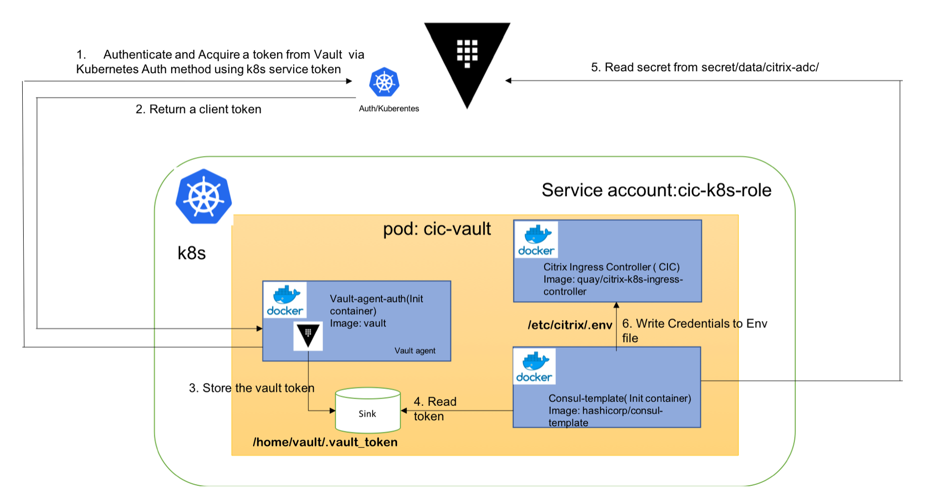

# Using Citrix ADC credentials stored in a Vault server for the Citrix ingress controller

In most organizations, tier 1 Citrix ADC Ingress devices and Kubernetes clusters are managed by separate teams. Usually, network administrators manage tier 1 Citrix ADC Ingress devices, while developers manage Kubernetes clusters. The Citrix ingress controller requires Citrix ADC credentials such as Citrix ADC user name and password to configure the Citrix ADC. You can specify Citrix ADC credentials as part of the Citrix ingress controller specification and store the ADC credentials as Kubernetes secrets. However, you can also store Citrix ADC credentials in a Vault server and pass credentials to the Citrix ingress controller to minimize any security risk. This topic provides information on how to use Citrix ADC credentials stored in a Vault server for the Citrix ingress controller.

The following diagram explains the steps for using Citrix ADC credentials which are stored in a Vault server with the Citrix ingress controller.

## Prerequisites

Ensure that you have setup a Vault server and enabled key-value (KV) secret store. For more information, see [Vault documentation](https://www.vaultproject.io/docs/install/index.html).

## Using Citrix ADC credentials from a Vault server for the Citrix ingress controller

Perform the following tasks to use Citrix ADC credentials from a Vault server for the Citrix ingress controller.

1. [Create a service account for Kubernetes authentication](#Create-a-service-account).

2. [Create a Key Vault secret and setup Kubernetes authentication on Vault server](#Create-a-key-vault-secret-and-setup-Kubernetes-authentication).
  
3. [Leverage Vault Auto-Auth functionality to fetch Citrix ADC credentials for the Citrix ingress controller](#Leverage-Vault-agent-auto-authentication-for-the-Citrix-ingress-controller).

### Create a service account for Kubernetes authentication

Create a service account for Kubernetes authentication by using the following steps:

1. Create a service account `cic-k8s-role` and provide the service account necessary permissions to access the Kubernetes TokenReview API by using the following command.

        $ kubectl apply -f cic-k8s-role-service-account.yml
         
            
        serviceaccount/cic-k8s-role created
        clusterrole.rbac.authorization.k8s.io/cic-k8s-role configured
        clusterrolebinding.rbac.authorization.k8s.io/cic-k8s-role configured
        clusterrolebinding.rbac.authorization.k8s.io/role-tokenreview-binding configured

    Following is a part of the sample [cic-k8s-role-service-account.yml](./examples-yamls/cic-k8s-role-service-account.yml) file.

        apiVersion: rbac.authorization.k8s.io/v1beta1
        kind: ClusterRoleBinding
        metadata:
        name: role-tokenreview-binding
        namespace: default
        roleRef:
        apiGroup: rbac.authorization.k8s.io
        kind: ClusterRole
        name: system:auth-delegator
        subjects:
        - kind: ServiceAccount
        name: cic-k8s-role
        namespace: default

2. Set the  `VAULT_SA_NAME` environment variable to the name of the service account you have already created.

        $ export VAULT_SA_NAME=$(kubectl get sa cic-k8s-role -o jsonpath="{.secrets[*]['name']}")

3. Set the  `SA_JWT_TOKEN` environment variable to the JWT of the service account that you used to access the TokenReview API.

        $ export SA_JWT_TOKEN=$(kubectl get secret $VAULT_SA_NAME -o jsonpath="{.data.token}" | base64 --decode; echo)

4. Get a Kubernetes CA signed certificate to communicate with Kubernetes API.

        $ export SA_CA_CRT=$(kubectl get secret $VAULT_SA_NAME -o jsonpath="{.data['ca\.crt']}" | base64 --decode; echo)

### Create a key vault secret and setup Kubernetes authentication on the Vault server

 Log in to the Vault server and perform the following steps to create a Key Vault secret and setup Kubernetes authentication.

1. Review the sample vault policy file [citrix-adc-kv-ro.hcl](./examples-yamls/citrix-adc-kv-ro.hcl) and create a read-only policy, `citrix-adc-kv-ro` in Vault.

        $ tee citrix-adc-kv-ro.hcl <<EOF 
        # If working with K/V v1
        path "secret/citrix-adc/*"
        {
            capabilities = ["read", "list"]
        }
        # If working with K/V v2
        path "secret/data/citrix-adc/*" 
        {
            capabilities = ["read", "list"]
        }
        EOF

        # Create a policy named citrix-adc-kv-ro
        $ vault policy write citrix-adc-kv-ro citrix-adc-kv-ro.hcl

2. Create a KV secret with Citrix ADC credentials at the `secret/citrix-adc/` path.
    
        vault kv put secret/citrix-adc/credential   username='<ADC username>' \
        password='<ADC password>' \
        ttl='30m'

3. Enable Kubernetes authentication at the default path (`auth/kubernetes`).
   
        $ vault auth enable kubernetes
   
        

              
4. Specify how to communicate with the Kubernetes cluster.

        $ vault write auth/kubernetes/config \
        token_reviewer_jwt="$SA_JWT_TOKEN" \
        kubernetes_host="https://<K8S_CLUSTER_URL>:<API_SERVER_PORT>" \
        kubernetes_ca_cert="$SA_CA_CRT"      

5. Create a role to map the Kubernetes service account to Vault policies and the default token TTL. This role authorizes the `cic-k8s-role` service account in the default namespace and maps the service account to the `citrix-adc-kv-ro` policy
  
   
        $ vault write auth/kubernetes/role/cic-vault-example\
        bound_service_account_names=cic-k8s-role \
        bound_service_account_namespaces=default \
        policies=citrix-adc-kv-ro \
        ttl=24h

!!! note "Note"
        Authorization with Kubernetes authentication back-end is role based. Before a token is used for login, it must be configured as part of a role.

### Leverage Vault agent auto-authentication for the Citrix ingress controller

Perform the following steps to leverage Vault auto-authentication.

1. Review the provided Vault Agent configuration file, [`vault-agent-config.hcl`](./examples-yamls/vault-agent-config.hcl).

            exit_after_auth = true
            pid_file = "/home/vault/pidfile"

            auto_auth {
                method "kubernetes" {
                    mount_path = "auth/kubernetes"
                    config = {
                        role = "cic-vault-example"
                    }
                }

                sink "file" {
                    config = {
                        path = "/home/vault/.vault-token"
                    }
                }
            }
            

    !!! note "Note"
            The Vault agent `Auto-Auth` is configured to use the Kubernetes authentication method enabled at the `auth/kubernetes` path on the Vault server. The Vault Agent uses the `cic-vault-example` role to authenticate.
            The sink block specifies the location on disk where to write tokens. Vault Agent `Auto-Auth` sink can be configured multiple times if you want Vault Agent to place the token into multiple locations. In this example, the sink is set to `/home/vault/.vault-token`.

2. Review the Consul template [consul-template-config.hcl](./examples-yamls/consul-template-config.hcl)
   file.

   
        vault {
            renew_token = false
            vault_agent_token_file = "/home/vault/.vault-token"
            retry {
                backoff = "1s"
            }
        }

        template {
            destination = "/etc/citrix/.env"
            contents = <<EOH
            {{- with secret "secret/citrix-adc/credential" }}
            NS_USER={{ .Data.data.username }}
            NS_PASSWORD={{ .Data.data.password }}
            {{ end }}
            EOH
        }

    !!! note "Note"
             This template reads secrets at the `secret/citrix-adc/credential` path and sets the user name and password values.
            If you are using KV store version 1, use the following template.
                
                template {
                        destination = "/etc/citrix/.env"
                        contents = <<EOH
                        {{- with secret "secret/citrix-adc/credential" }}
                        NS_USER={{ .Data.username }}
                        NS_PASSWORD={{ .Data.password }}
                        {{ end }}
                        EOH
                    }
        
    
3. Create a Kubernetes config-map from [vault-agent-config.hcl](./examples-yamls/vault-agent-config.hcl) and [consul-template-config.hcl](./examples-yamls/consul-template-config.hcl).
    
            kubectl create configmap example-vault-agent-config --from-file=./vault-agent-config.hcl --form-file=./consul-template-config.hcl

4. Create a Citrix ingress controller pod with Vault and consul template as init container [citrix-k8s-ingress-controller-vault.yaml](./examples-yamls/citrix-k8s-ingress-controller-vault.yaml). Vault fetches the token using the Kubernetes authentication method and pass it on to a consul template which creates the `.env` file on shared volume. This token is used by the Citrix ingress controller for authentication with tier 1 Citrix ADC.

            kubectl apply citrix-k8s-ingress-controller-vault.yaml
   

    The  `citrix-k8s-ingress-controller-vault.yaml` file is as follows:

                apiVersion: v1
                kind: Pod
                metadata:
                annotations:
                name: cic-vault
                namespace: default
                spec:
                containers:
                - args:
                    - --ingress-classes tier-1-vpx
                    - --feature-node-watch true
                    env:
                    - name: NS_IP
                    value: <Tier 1 ADC IP-ADDRESS>
                    - name: EULA
                    value: "yes"
                    image: in-docker-reg.eng.citrite.net/cpx-dev/kumar-cic:latest
                    imagePullPolicy: Always
                    name: cic-k8s-ingress-controller
                    volumeMounts:
                    - mountPath: /etc/citrix
                    name: shared-data
                initContainers:
                - args:
                    - agent
                    - -config=/etc/vault/vault-agent-config.hcl
                    - -log-level=debug
                    env:
                    - name: VAULT_ADDR
                    value: <VAULT URL>
                    image: vault
                    imagePullPolicy: Always
                    name: vault-agent-auth
                    volumeMounts:
                    - mountPath: /etc/vault
                    name: config
                    - mountPath: /home/vault
                    name: vault-token
                - args:
                    - -config=/etc/consul-template/consul-template-config.hcl
                    - -log-level=debug
                    - -once
                    env:
                    - name: HOME
                    value: /home/vault
                    - name: VAULT_ADDR
                    value: <VAULT_URL>
                    image: hashicorp/consul-template:alpine
                    imagePullPolicy: Always
                    name: consul-template
                    volumeMounts:
                    - mountPath: /home/vault
                    name: vault-token
                    - mountPath: /etc/consul-template
                    name: config
                    - mountPath: /etc/citrix
                    name: shared-data
                serviceAccountName: vault-auth
                volumes:
                - emptyDir:
                    medium: Memory
                    name: vault-token
                - configMap:
                    defaultMode: 420
                    items:
                    - key: vault-agent-config.hcl
                        path: vault-agent-config.hcl
                    - key: consul-template-config.hcl
                name: example-vault-agent-config
                    name: config
                - emptyDir:
                    medium: Memory
                    name: shared-data        

If the configuration is successful, the Vault server fetches a token and passes it on to a Consul template container. The Consul template uses the token to read Citrix ADC credentials and write it as an environment variable in the path ``/etc/citrix/.env``. The Citrix ingress controller uses these credentials for communicating with the tier 1 Citrix ADC.

Verify that the Citrix ingress controller is running successfully using credentials fetched from the Vault server.
