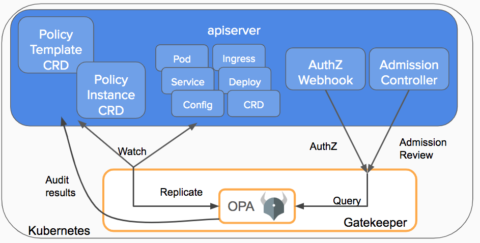

# Support for admission controller webhooks

[Admission controllers](https://kubernetes.io/docs/reference/access-authn-authz/admission-controllers/) are powerful tools for intercepting requests to the Kubernetes API server prior to the persistence of the object. Using Kubernetes admission controllers, you can define and customize what is allowed to run on your cluster. Hence, they are useful tools for cluster administrators to deploy preventive security controls on your cluster. But you need to compile the admission controllers into the `kube-apiserver` binary and they offer limited flexibility.

To overcome this limitation, Kubernetes supports dynamic admission controllers that can be developed as extensions and run as webhooks configured at runtime.
Using the [Admission controller webhooks](https://kubernetes.io/docs/reference/access-authn-authz/extensible-admission-controllers/#admission-webhooks) Kubernetes cluster administrators can create additional plug-ins to the admission chain of API server without recompiling them. Admission controller webhooks can be executed whenever a resource is created, updated, or deleted.

You can define two types of admission controller webhooks:

- validating admission webhook
- mutating admission webhook

 Mutating admission webhooks are invoked first, and they can modify objects sent to the API server to enforce custom defaults. Once all the object modifications are complete, and the incoming object is validated by the API server, validating admission webhooks are invoked. Validating admission hooks process requests and accept or reject requests to enforce custom
  policies.

The following diagram explains how the admission controller webhook works:

Here are some of the scenarios where admission webhooks are useful:

- To mandate a reasonable security baseline across an entire namespace or cluster mandating. For example, disallowing containers from running as root or making sure the container’s root filesystem is always mounted as read-only.
- To enforce the adherence to certain standard and practices for labels, annotations, or resource limits. For example, enforce label validation on different objects to ensure proper labels are being used for various objects.
  
- To validate the configuration of the objects running in the cluster and prevent any obvious misconfigurations from hitting your cluster.
For example, to detect and fix images deployed without semantic tags.

## How to apply admission controllers

Writing an admission controller for each specific use case is not scalable and it helps to have a system that that supports multiple configurations covering different resource types and fields. You can use [Open policy agent (OPA)](https://github.com/open-policy-agent) and [Gatekeeper](https://github.com/open-policy-agent/gatekeeper) to implement a customizable admission webhook for Kubernetes.

OPA is an open source, general-purpose policy engine that unifies policy enforcement across the stack. Gatekeeper is a customizable validating webhook that enforces CRD-based policies executed by OPA.

(image [credit](https://kubernetes.io/blog/2019/08/06/opa-gatekeeper-policy-and-governance-for-kubernetes/))

Gatekeeper introduces the following functionalities

- An extensible, parameterized policy library
- Native Kubernetes CRDs for instantiating the policy library (constraints)
- Native Kubernetes CRDs for extending the policy library (constraint templates
- Audit functionality

## Writing and deploying an admission controller webhook

### Prerequisites

- Kubernetes 1.14.0 or later with the admissionregistration.k8s.io/v1beta1 API enabled.  
   You can verify whether the API is enabled by using the following command:

        kubectl api-versions | grep admissionregistration.k8s.io/v1beta1

    The following output indicates that the API is enabled:

        admissionregistration.k8s.io/v1beta1

- The mutating admission webhook and validate admission webhook admission controllers should be added and listed in the correct order in the admission-control flag of `kube-apiserver`.

  With Minikube, you can perform this task by starting Minikube with the following command:

        minikube start --extra-config=apiserver.enable-admission-plugins=NamespaceLifecycle,LimitRanger,ServiceAccount,DefaultStorageClass,DefaultTolerationSeconds,NodeRestriction,MutatingAdmissionWebhook,ValidatingAdmissionWebhook`

- Ensure that you have cluster administrator permissions.

        kubectl create clusterrolebinding cluster-admin-binding --clusterrole cluster-admin --user <YOUR USER NAME>

### Mutating admission webhook configuration

For more information on mutating admission webhook configuration, see [ingress-admission-webhook](https://github.com/citrix/ingress-admission-webhook).

The following use cases are covered in the mutating admission webhook example:

- Update port in an Ingress based on the Ingress name
- Enable secure back-end forcefully based on a namespace
  
## Validating admission webhook configuration using Gatekeeper

Gatekeeper uses a CRD that allows you to create constraints as Kubernetes resources. This CRD is called a `ConstraintTemplate` in Gatekeeper. The schema of the constraint allows an administrator to fine-tune the behavior of a constraint, similar to arguments to a function. Constraints are used to inform Gatekeeper that the administrator wants a constraint template to be enforced, and how.

You can apply various policies using constraint templates. Various examples are listed at the [Gatekeeper library](https://github.com/open-policy-agent/gatekeeper/tree/master/library).

### Deploying a sample policy

Perform the following steps to deploy `HttpsOnly` as a sample policy using Gatekeeper. The `HttpsOnly` policy allows only an Ingress configuration with HTTPS.

1. Install Gatekeeper using the following command.

   **Note:**
   In this step, Gatekeeper is installed using a prebuilt image. You can install Gatekeeper using various methods mentioned in the Gatekeeper installation.

        # kubectl apply -f https://raw.githubusercontent.com/open-policy-agent/gatekeeper/master/deploy/gatekeeper.yaml

   You can verify the installation using the following command.
        
        kubectl get crd | grep -i constraintsonstrainttemplates.templates.gatekeeper.sh  
    
   You can check all the constraint templates using the following command:

         kubectl get constrainttemplates.templates.gatekeeper.sh
    
2. Apply the `httpsonly ` constraint template.
        
        kubectl apply -f https://raw.githubusercontent.com/citrix/citrix-k8s-ingress-controller/master/docs/how-to/webhook/httpsonly/template.yaml

3. Apply a constraint to enforce the `httpsonly` policy.
        
        kubectl apply -f https://raw.githubusercontent.com/citrix/citrix-k8s-ingress-controller/master/docs/how-to/webhook/httpsonly/constraint.yaml

4. Deploy a sample Ingress which violates the policy to verify the policy. It should display an error while creating the Ingress.
       
        kubectl apply -f https://raw.githubusercontent.com/citrix/citrix-k8s-ingress-controller/master/docs/how-to/webhook/httpsonly/bad-example-ingress.yaml

        Error from server ([denied by ingress-https-only] Ingress must be https. tls configuration is required for test-ingress): error when creating "ingress.yaml": admission webhook "validation.gatekeeper.sh" denied the request: [denied by ingress-https-only] Ingress must be https. tls configuration is required for test-ingress

5. Now, deploy an Ingress which has the required TLS section in Ingress.
   
        # kubectl apply -f  https://raw.githubusercontent.com/citrix/citrix-k8s-ingress-controller/master/docs/how-to/webhook/httpsonly/good-example-ingress.yaml
       
        ingress.networking.k8s.io/test-ingress created

6. Clean up the installation using the following commands once you have finished the verification of Gatekeeper policies.
   
        Uninstall all packages and template installed.
        kubectl delete -f https://raw.githubusercontent.com/citrix/citrix-k8s-ingress-controller/master/docs/how-to/webhook/httpsonly/good-example-ingress.yaml
        kubectl delete -f https://raw.githubusercontent.com/citrix/citrix-k8s-ingress-controller/master/docs/how-to/webhook/httpsonly/constraint.yaml
        kubectl delete -f https://raw.githubusercontent.com/citrix/citrix-k8s-ingress-controller/master/docs/how-to/webhook/httpsonly/template.yaml
        kubectl delete -f https://raw.githubusercontent.com/open-policy-agent/gatekeeper/master/deploy/gatekeeper.yaml

## More sample use cases

There are multiple use cases listed under the webhook directory.
The steps are similar to what is specified in the example and can be summarized as follows:

1. Apply the template YAML file given in each use case directory.
2. Apply the constraint YAML file.
3. Verify by applying bad or good sample YAML files to validate the use case.