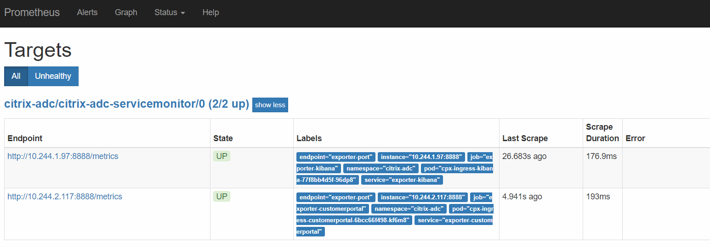
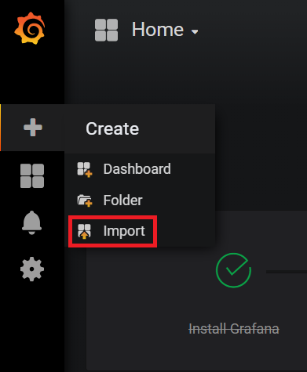
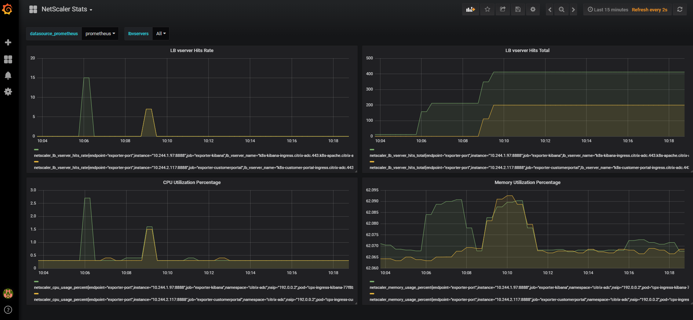

# View metrics of Citrix ADCs using Prometheus and Grafana

You can use the [Citrix ADC metrics exporter](https://github.com/citrix/citrix-adc-metrics-exporter) and [Prometheus-Operator](https://github.com/coreos/prometheus-operator) to monitor Citrix ADC VPX or CPX ingress devices and Citrix ADC CPX (east-west) devices.

## Citrix ADC metrics exporter

Citrix ADC metrics exporter is a simple server that collects Citrix ADC stats and exports them to Prometheus using `HTTP`. You can then add Prometheus as a data source to Grafana and graphically view the Citrix ADC stats. For more information see, [Citrix ADC metrics exporter](https://github.com/citrix/citrix-adc-metrics-exporter).

## Launch prometheus operator

The Prometheus Operator has an expansive method of monitoring services on Kubernetes. To get started, this topic uses `kube-prometheus` and its manifest files. The manifest files help you to deploy a basic working model. Deploy the Prometheus Operator in your Kubernetes environment using the following commands:

    git clone https://github.com/coreos/kube-prometheus.git
    kubectl create -f kube-prometheus/manifests/setup/
    kubectl create -f kube-prometheus/manifests/

Once you deploy [Prometheus-Operator](https://github.com/coreos/prometheus-operator), several pods and services are deployed. From the deployed pods, the `prometheus-k8s-xx` pods are for metrics aggregation and timestamping, and the `grafana` pods are for visualization. If you view all the container images running in the cluster, you can see the following output:

    $ kubectl get pods -n monitoring
    NAME                                   READY     STATUS    RESTARTS   AGE
    alertmanager-main-0                    2/2       Running   0          2h
    alertmanager-main-1                    2/2       Running   0          2h
    alertmanager-main-2                    2/2       Running   0          2h
    grafana-5b68464b84-5fvxq               1/1       Running   0          2h
    kube-state-metrics-6588b6b755-d6ftg    4/4       Running   0          2h
    node-exporter-4hbcp                    2/2       Running   0          2h
    node-exporter-kn9dg                    2/2       Running   0          2h
    node-exporter-tpxhp                    2/2       Running   0          2h
    prometheus-k8s-0                       3/3       Running   1          2h
    prometheus-k8s-1                       3/3       Running   1          2h
    prometheus-operator-7d9fd546c4-m8t7v   1/1       Running   0          2h

!!! note "Note"
    The files in the `manifests` folder are interdependent and hence the order in which they are created is important. In certain scenarios the manifest files might be created out of order and this leads to an error messages from Kubernetes.
    To resolve this scenario, re-execute the `kubectl create -f kube-prometheus/manifests/` command. Any YAML files that were not created the first time due to unmet dependencies, are created now.

It is recommended to expose the Prometheus and Grafana pods through NodePorts. To do so, you need to modify the `prometheus-service.yaml` and `grafana-service.yaml` files as follows:

**prometheus-service.yaml**:

```yml
apiVersion: v1
kind: Service
metadata:
  labels:
    prometheus: k8s
  name: prometheus-k8s
  namespace: monitoring
spec:
  type: NodePort
  ports:
  - name: web
    port: 9090
    targetPort: web
  selector:
    app: prometheus
    prometheus: k8s
```

After you modify the `prometheus-service.yaml`file, apply the changes to the Kubernetes cluster using the following command:

    kubectl apply -f prometheus-service.yaml

**grafana-service.yaml**:

```
apiVersion: v1
kind: Service
metadata:
  name: grafana
  namespace: monitoring
spec:
  type: NodePort
  ports:
  - name: http
    port: 3000
    targetPort: http
  selector:
    app: grafana
```

After you modify the `grafana-service.yaml`file, apply the changes to the Kubernetes cluster using the following command:

    kubectl apply -f grafana-service.yaml

## Configure Citrix ADC metrics exporter

This topic describes how to integrate the [Citrix ADC metrics exporter](https://github.com/citrix/citrix-adc-metrics-exporter) with Citrix ADC VPX or CPX ingress or Citrix ADC CPX (east-west) devices.

**Citrix ADC VPX Ingress device**:

To monitor an ingress Citrix ADC VPX device, the Citrix ADC metrics exporter is run as a pod within the Kubernetes cluster. The IP address of the Citrix ADC VPX ingress device is provided as an argument to the Citrix ADC metrics exporter. To provide the login credentials to access ADC, create a secret and mount the volume at mountpath "/mnt/nslogin".
```
kubectl create secret generic nslogin --from-literal=username=<citrix-adc-user> --from-literal=password=<citrix-adc-password> -n <namespace>
```
The following is a sample YAML file to deploy the exporter:

```YAML
apiVersion: v1
kind: Pod
metadata:
  name: exporter-vpx-ingress
  labels:
    app: exporter-vpx-ingress
spec:
  containers:
    - name: exporter
      image: "quay.io/citrix/citrix-adc-metrics-exporter:1.4.8"
      imagePullPolicy: IfNotPresent
      args:
        - "--target-nsip=<IP_of_VPX>"
        - "--port=8888"
      volumeMounts:
      - name: nslogin
        mountPath: "/mnt/nslogin"
        readOnly: true
      securityContext:
        readOnlyRootFilesystem: true
  volumes:
  - name: nslogin
    secret:
      secretName: nslogin
---
kind: Service
apiVersion: v1
metadata:
  name: exporter-vpx-ingress
  labels:
    service-type: citrix-adc-monitor
spec:
  selector:
    name: exporter-vpx-ingress
  ports:
    - name: exporter-port
      port: 8888
      targetPort: 8888
```

The IP address and the port of the Citrix ADC VPX device needs to be provided in the `--target-nsip` parameter. For example, `--target-nsip=10.0.0.20`.

**Citrix ADC CPX Ingress device**:

To monitor a Citrix ADC CPX ingress device, the Citrix ADC metrics exporter is added as a sidecar to the Citrix ADC CPX.The following is a sample YAML file of a Citrix ADC CPX ingress device with the exporter as a side car:

```YAML
---
apiVersion: extensions/v1beta1
kind: Deployment
metadata:
  name: cpx-ingress
  labels:
    app: cpx-ingress
spec:
  replicas: 1
  selector:
    matchLabels:
      app: cpx-ingress
  template:
    metadata:
      labels:
        app: cpx-ingress
      annotations:
        NETSCALER_AS_APP: "True"
    spec:
      serviceAccountName: cpx
      containers:
        - name: cpx-ingress
          image: "quay.io/citrix/citrix-k8s-cpx-ingress:13.0-52.24"
          imagePullPolicy: IfNotPresent
          securityContext:
            privileged: true
          env:
            - name: "EULA"
              value: "YES"
            - name: "NS_PROTOCOL"
              value: "HTTP"
            #Define the NITRO port here
            - name: "NS_PORT"
              value: "9080"
          ports:
            - name: http
              containerPort: 80
            - name: https
              containerPort: 443
            - name: nitro-http
              containerPort: 9080
            - name: nitro-https
              containerPort: 9443
        # Adding exporter as a sidecar
        - name: exporter
          image: "quay.io/citrix/citrix-adc-metrics-exporter:1.4.8"
          imagePullPolicy: IfNotPresent
          args:
            - "--target-nsip=192.0.0.2"
            - "--port=8888"
            - "--secure=no"
          env:
          - name: "NS_USER"
            value: "nsroot"
          - name: "NS_PASSWORD"
            value: "nsroot"
          securityContext:
            readOnlyRootFilesystem: true
---
kind: Service
apiVersion: v1
metadata:
  name: exporter-cpx-ingress
  labels:
    service-type: citrix-adc-monitor
spec:
  selector:
    app: cpx-ingress
  ports:
    - name: exporter-port
      port: 8888
      targetPort: 8888
```

Here, the exporter uses the local IP address (`192.0.0.2`) to fetch metrics from the Citrix ADC CPX.

**Citrix ADC CPX (east-west) device**:

To monitor a Citrix ADC CPX (east-west) device, the Citrix ADC metrics exporter is added as a sidecar to the Citrix ADCCPX.The following is a sample YAML file of a Citrix ADC CPX (east-west) device with the exporter as a side car:

```YAML
apiVersion: extensions/v1beta1
kind: DaemonSet
metadata:
  name: cpx-ew
spec:
  template:
    metadata:
      name: cpx-ew
      labels:
        app: cpx-ew
      annotations:
        NETSCALER_AS_APP: "True"
    spec:
      serviceAccountName: cpx
      hostNetwork: true
      containers:
        - name: cpx
          image: "quay.io/citrix/citrix-k8s-cpx-ingress:13.0-52.24"
          securityContext:
             privileged: true
          env:
          - name: "EULA"
            value: "yes"
          - name: "NS_NETMODE"
            value: "HOST"
          #- name: "kubernetes_url"
          #  value: "https://10..xx.xx:6443"
        # Add exporter as a sidecar
        - name: exporter
          image: "quay.io/citrix/citrix-adc-metrics-exporter:1.4.8"
          args:
            - "--target-nsip=192.168.0.2"
            - "--port=8888"
            - "--secure=no"
          env:
          - name: "NS_USER"
            value: "nsroot"
          - name: "NS_PASSWORD"
            value: "nsroot"
          securityContext:
            readOnlyRootFilesystem: true
          imagePullPolicy: IfNotPresent
---
kind: Service
apiVersion: v1
metadata:
  name: exporter-cpx-ew
  labels:
    service-type: citrix-adc-monitor
spec:
  selector:
    app: cpx-ew
  ports:
    - name: exporter-port
      port: 8888
      targetPort: 8888
```

Here, the exporter uses the local IP (`192.168.0.2`) to fetch metrics from the Citrix ADC CPX (east-west) device.

### ServiceMonitors to detect Citrix ADC

The Citrix ADC metrics exporter helps collect data from the Citrix ADC VPX or CPX ingress and Citrix ADC CPX (east-west) devices. The Prometheus Operator needs to detect these exporters so that the metrics can be timestamped, stored, and exposed for visualization on Grafana. The Prometheus Operator uses the concept of ServiceMonitors to detect pods that belong to a service, using the labels attached to that service.

The following example YAML file detects all the exporter services (given in the sample YAML files) which have the label `service-type: citrix-adc-monitor` associated with them.

```YAML
apiVersion: monitoring.coreos.com/v1
kind: ServiceMonitor
metadata:
  name: citrix-adc-servicemonitor
  labels:
    servicemonitor: citrix-adc
spec:
  endpoints:
  - interval: 30s
    port: exporter-port
  selector:
    matchLabels:
      service-type: citrix-adc-monitor
  namespaceSelector:
    matchNames:
    - monitoring
    - default
```

The `ServiceMonitor` directs Prometheus to detect Exporters in the `default` and `monitoring` namespaces only. To detect Exporters from other namespaces add the names of those namespaces under the `namespaceSelector:` field.

!!! note "Note"
    If the Exporter that needs to be monitored exists in a namespace other than the `default` or `monitoring` namespace, then additional RBAC privileges must be provided to Prometheus to access those namespaces. The following is sample YAML (`prometheus-clusterRole.yaml`) file the provides Prometheus full access to resources across the namespaces:

```yml
apiVersion: rbac.authorization.k8s.io/v1
kind: ClusterRole
metadata:
  name: prometheus-k8s
rules:
- apiGroups:
  - ""
  resources:
  - nodes/metrics
  - namespaces
  - services
  - endpoints
  - pods
  verbs: ["*"]
- nonResourceURLs:
  - /metrics
  verbs:  ["*"]
```

To provide additional privileges Prometheus, deploy the sample YAML using the following command:

    kubectl apply -f prometheus-clusterRole.yaml

### View the metrics in grafana

The Citrix ADC instances that are detected for monitoring appears in the **Targets** page of the prometheus container. You can be access the **Targets** page using the following URL: `http://<k8s_cluster_ip>:<prometheus_nodeport>/targets`:



To view the metrics graphically:

1.  Log into grafana using `http://<k8s_cluster_ip>:<grafafa_nodeport>` with default credentials *admin:admin*

1.  On the left panel, select **+** and click **Import** to import the [sample grafana dashboard](https://github.com/citrix/citrix-adc-metrics-exporter/blob/master/sample_lb_stats.json).

    

    A dashboard containing the graphs similar to the following appears:

    

    You can further enhance the dashboard using Grafana's [documentation](http://docs.grafana.org/) or [demo videos](https://www.youtube.com/watch?v=mgcJPREl3CU).
