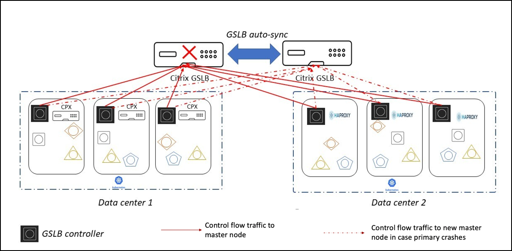

# Multi-cluster ingress and load balancing solution using the Citrix ingress controller

## Overview

For ensuring high availability, proximity based load balancing, and scalability, you may need to deploy an application in multiple distributed Kubernetes clusters. When the same application is deployed in multiple Kubernetes clusters, a load balancing decision has to be taken among application instances dispersed across clusters.

For implementing a load balancing solution for distributed Kubernetes clusters, the health of applications across clusters needs to be monitored globally. You need to monitor application availability and performance, update the application status across clusters, collect statistics from endpoints in data centers, and share the statistics across data centers.

Citrix provides a multi-cluster ingress and load balancing solution which globally monitors applications, collect, and share metrics across different clusters, and provides intelligent load balancing decisions. It ensures better performance and reliability for your Kubernetes services that are exposed using Ingress or using type LoadBalancer.

## Deployment topology

The following diagram explains a deployment topology for the multi-cluster ingress and load balancing solution for Kubernetes clusters.

**Note:** Services of type LoadBalancer (available for bare metal clusters using Citrix ADC) are also supported.

This diagram shows a sample topology with two data centers and each data center contains multiple Kubernetes clusters. For data center 1, Citrix ADC CPX is deployed as the Ingress load balancer in each Kubernetes cluster. For data center 2, HAProxy is deployed as the load balancer in each Kubernetes cluster. Citrix multi-cluster ingress and load balancing solution for Kubernetes load balances across the ingresses.

**Note:** Any ingress solution, including third party solutions such as Istio ingress gateway as well as the Citrix ingress controller with Citrix ADC MPX, VPX, or BLX is supported. This topology is just a sample deployment.

A Citrix global server load balancing (GSLB) device is configured for each data center. In each Citrix ADC which acts as a global load balancer, one site is configured as a local site representing the local data center. The other sites are configured as remote sites for each remote data center. The Citrix ADC (MPX or VPX) used as the GSLB can be also used as the Ingress appliance with the Citrix ingress controller.

The global server load balancing (GSLB) configuration synchronization option of the Citrix ADC is used to synchronize the configuration across the sites. The Citrix ADC appliance from which you use the synchronization is referred as the master node and the site where the configuration is copied as the subordinate site.

Each cluster in the deployment runs an instance of the GSLB Kubernetes controller. GSLB controller is the module responsible for the configuration of the Citrix ADC GSLB device. The GSLB controller configures the GSLB master device for the applications deployed in their respective cluster. The GSLB master device pushes the GSLB configuration to the remaining GSLB subordinate devices using the GSLB sync feature. When you synchronize a GSLB configuration, the configurations on all the GSLB sites participating in the GSLB setup are made similar to the configuration on the master site.

The multi-cluster ingress and load balancing solution can be applied for any Kubernetes object which is used to route traffic into the cluster.

The following global load balancing methods are supported:

-  [Round trip time (RTT)](https://docs.citrix.com/en-us/citrix-adc/13/global-server-load-balancing/methods/dynamic-round-trip-time-method.html)
-  [Static proximity](https://docs.citrix.com/en-us/citrix-adc/13/global-server-load-balancing/methods/static-proximity.html)
-  [Round robin (RR)](https://docs.citrix.com/en-us/citrix-adc/13/load-balancing/load-balancing-customizing-algorithms/roundrobin-method.html)

The following deployment types are supported:

-  Local first: In a local first deployment, when an application wants to communicate with another application it prefers a local application in the same cluster. When the application is not available locally, the request is directed to other clusters or regions.

-  Canary: Canary release is a technique to reduce the risk of introducing a new software version in production by first rolling out the change to a small subset of users. In this solution, canary deployment can be used when you want to roll out new versions of the application to selected clusters before moving it to production.

-  Failover: A failover deployment is used when you want to deploy applications in an active/passive configuration when they cannot be deployed in active/active mode.

-  Round trip time (RTT):  In an RTT deployment, the real-time status of the network is monitored and dynamically directs the client request to the data center with the lowest RTT value.

-  Static proximity: In a static proximity deployment, an IP-address based static proximity database is used to determine the proximity between the client’s local DNS server and the GSLB sites. The requests are sent to the site that best matches the proximity criteria.

-  Round robin: In a round robin deployment, the GSLB device continuously rotates a list of the services that are bound to it. When it receives a request, it assigns the connection to the first service in the list, and then moves that service to the bottom of the list.

**Note:**
  Currently, IPv6 is not supported.

## CRDs for configuring Multi-cluster ingress and load balancing solution for Kubernetes clusters

The following CRDs are introduced to support the Citrix ADC configuration for performing GSLB of Kubernetes applications.

-  Global traffic policy (GTP)
-  Global service entry (GSE)

### GTP CRD

GTP CRD accepts the parameters for configuring GSLB on the Citrix ADC including deployment type (canary, failover, local-first), GSLB domain, health monitor for the Ingress, and service type.

The GTP CRD spec is available in the Citrix ingress controller GitHub repo at: [grp-crd.yaml](https://github.com/citrix/citrix-k8s-ingress-controller/blob/master/multicluster/Manifest/gtp-crd.yaml).

### GSE CRD

GSE CRD dictates the endpoint information (any Kubernetes object which routes traffic into the cluster) in each cluster.

The GSE CRD Spec is available in the citrix ingress controller GitHub repo at: [gse-crd.yaml](https://github.com/citrix/citrix-k8s-ingress-controller/blob/master/multicluster/Manifest/gse-crd.yaml)

The GSE CRD is auto generated for an Ingress object if the service specified in the Ingress resource is referred in the GTP CRD instance and the `status-loadbalancer-ip/hostname` field is already populated. For a service of type `LoadBalancer`, the GSE CRD is auto generated if the service is referred in the GTP CRD instance and the `status-loadbalancer-ip/hostname` field is already populated.

**Note:**
For GSE CRD auto generation in the case of Ingress, host name should exactly match with the host name specified in the GTP CRD instance. For both Ingress and service of type `LoadBalancer`, the GSE CRD is generated only for the first port specified.

## Deploy Citrix Multi-cluster ingress and load balancing solution

### Prerequisites**

-  You should configure GSLB sites on the Citrix ADC which acts as the GSLB device.
-  Features like content switching and SSL should be enabled in the GSLB device
-  For static proximity, the location database has to be applied externally

Perform the following steps to deploy the Citrix global load balancing solution for geographically distributed Kubernetes clusters.

1.  Create the RBAC permissions required to deploy the GSLB controller using the [gslb-rbac.yaml](https://github.com/citrix/citrix-k8s-ingress-controller/blob/master/multicluster/Manifest/gslb-rbac.yaml) file.

        kubectl apply -f gslb-rbac.yaml

2.  Create the secrets required for the GSLB controller to connect to GSLB devices and push the configuration from the GSLB controller.

        kubectl create secret generic secret-1 --from-literal=username=<username for gslb device1> --from-literal=password=<password for gslb device1>
        kubectl create secret generic secret-2 --from-literal=username=<username for gslb device2> --from-literal=password=<password for gslb device2>

     **Note:** These secrets are used in the GSLB controller YAML file for the respective sites. The `username` and `password` in the command specifies the user name and password of the Citrix GSLB ADC.

3.  Download the GSLB controller YAML file [gslb-controller.yaml](https://github.com/citrix/citrix-k8s-ingress-controller/blob/master/multicluster/Manifest/gslb-controller.yaml).

4.  Edit the GSLB controller YAML file and update the following values as per the requirements of each cluster.

    -  LOCAL_REGION and LOCAL_CLUSTER: Specify the region and cluster name where this controller is deployed.
    -  SITENAMES: Provide site names separated by commas and the configuration should be the same as the site configured on GSLB devices.
    -  IP address, region, user name, and password for each site should start with the corresponding site name.
    For example: For site1 in `SITENAMES`, fields should be `site1_ip`, `site1_region`, `site1_username`, and `site1_password`.
    -  argument section in the specification should include `--config-interface` and    `gslb-endpoint`.

     The following is a snippet of the YAML file for deploying the GSLB controller.

        env:
         - name: "LOCAL_REGION"
           value: "east"
         - name: "LOCAL_CLUSTER"
           value: "cluster1"
         - name: "SITENAMES"
           value: "site1,site2"
         - name: "site1_ip"
           value: "x.x.x.x"
         - name: "site1_region"
           value: "east"
         - name: "site1_username"
           valueFrom:
             secretKeyRef:
               name: secret-1
               key: username
         - name: "site1_password"
           valueFrom:
             secretKeyRef:
               name: secret-1
               key: password
         - name: "site2_ip"
           value: "x.x.x.x"
         - name: "site2_region"
           value: "west"
         - name: "site2_username"
           valueFrom:
             secretKeyRef:
               name: secret-2
               key: username
         - name: "site2_password"
           valueFrom:
             secretKeyRef:
               name: secret-2
               key: password
        args:
        - --config-interface
            gslb-endpoints

    **Note:**
     The order of the GSLB site information should be the same in all clusters. First site in the order is considered as the master site for pushing the configuration. When that master site goes down, the next site in the list will be the new master. Hence, the order of the sites should be the same in all Kubernetes clusters. For example,
     if the order of sites is `site1` followed by `site2` in cluster1 all other clusters should follow the same order.

5.  Deploy the modified GSLB controller YAML file specific to each cluster on the corresponding cluster.

        kubectl apply -f gslb-controller.yaml

6.  Deploy the [GTP CRD](https://github.com/citrix/citrix-k8s-ingress-controller/blob/master/multicluster/Manifest/gtp-crd.yaml) definition YAML file, using the following command.

        kubectl create -f  gtp-crd.yaml

7.  Deploy the [GSE CRD](https://github.com/citrix/citrix-k8s-ingress-controller/blob/master/multicluster/Manifest/gse-crd.yaml) definition YAML file using the following command.

        kubectl create -f  gse-crd.yaml

8.  Define the GTPs for your domain as YAML files and apply GTP instances.

        kubectl create -f  gtp-example.yaml

    **Note:** GTP CRD should be applied across all clusters with the same configuration for the same domain.

    Following is an example for a global traffic policy configuration where traffic policy is specified as local first for the domain `app2.com`. When your application prefers services local to it, you can use this option. The CIDR of the local cluster (cluster1) is specified using the `CIDR` field. The `weight` field is used to direct more client requests to any particular cluster than other clusters when the GSLB decision is taken by the Citrix ADC.
    The load balancing method is specified using the `secLbMethod` field as round robin.

    **Note:** You can specify the load balancing method for local first, canary, and failover deployments.

        apiVersion: "citrix.com/v1beta1"
        kind: globaltrafficpolicy
        metadata:
          name: gtp1
          namespace: default
        spec:
          serviceType: 'HTTP'
          hosts:
          - host: 'app2.com'
            policy:
              trafficPolicy: 'LOCAL-FIRST'
              secLbMethod: 'ROUNDROBIN'
              targets:
              - destination: 'app2.default.east.cluster1'
                CIDR: '10.102.217.69/24'
                weight: 1
              - destination: 'app2.default.west.cluster2'
                weight: 1
              monitor:
              - monType: tcp
                uri: ''
                respCode: 200

    For more information on other GTP deployment options like canary and failover, see [Examples: Global traffic policy deployments](#Examples-Global-traffic-policy-deployments).

9.  Apply GSE instances manually for GSLB of ingress.

        kubectl create -f  gse-example.yaml

    **Note:**  GSE CRD is applied in a specific cluster based on the cluster endpoint information. The global service entry name should be the same as the target destination name in the global traffic policy.

    Following is an example for a global service entry.

        apiVersion: "citrix.com/v1beta1"
        kind: globalserviceentry
        metadata:
          name: 'app2.default.east.cluster1'
          namespace: default
        spec:
          endpoint:
            ipv4address: 10.102.217.70
            monitorPort: 33036

    In this example, the global service entry name `app2.default.east.cluster1` is one of the target destination names in the global traffic policy created in step 8.

10.  Apply service YAML for GSLB of services of type LoadBalancer.

          kubectl create -f  service-example.yaml

     Following is a sample service.

          apiVersion: v1
          kind: Service
          metadata:
            name: cold
            namespace: default
          spec:
            type: LoadBalancer
            ports:
            - name: port-8080
              port: 8090
              targetPort: 8080
            selector:
              dep: citrixapp
          status:
            loadBalancer:
              ingress:
              - ip: 10.102.217.72

For a sample configuration of multi-cloud ingress and load balancing solution for Amazon EKS and Microsoft AKS clusters using Citrix ADC, see the [Multi-cloud and multi-cluster ingress and load balancing solution with Amazon EKS and Microsoft AKS clusters](../deploy/multi-cloud-ingress-lb-solution.md).

## How to direct the DNS resolution of pods to Citrix GSLB ADC

**Note:** This procedure is optional and needed only if the pods within the cluster need to resolve the DNS through the Citrix GSLB ADC.

### When pods are within the Kubernetes cluster

When you want the pods in a Kubernetes cluster to use the GSLB solution, the ConfigMap of the DNS provider should be updated to forward the request for a domain (for which GSLB is required) to Citrix GSLB ADC.

The following example shows how to update the ConfigMap if the DNS provider is CoreDNS.

      # kubectl edit configmap coredns -n kube-system

        apiVersion: v1
        data:
          Corefile: |
            cluster.local:53 {
                  errors
                  health
                  kubernetes cluster.local in-addr.arpa ip6.arpa {
                      pods insecure
                      upstream
                      fallthrough in-addr.arpa ip6.arpa
                      ttl 60
                  }
                  prometheus :9153
                  forward . /etc/resolv.conf
                  cache 90
                  loop
                  reload
                  loadbalance
            }
            app2.com.:53 {
                errors
                cache 30
                forward . 10.102.217.149
            }
        kind: ConfigMap
        metadata:
          creationTimestamp: "2019-08-30T10:59:36Z"
          name: coredns
          namespace: kube-system
          resourceVersion: "43569751"
          selfLink: /api/v1/namespaces/kube-system/configmaps/coredns
          uid: ac1d92e4-260f-45bd-8708-5f8194482885

As shown in the example, you need to add the required configuration for your domain if you want a pod to have a GSLB decision for applications hosted behind a domain. Here, the domain name is `app2.com`.

      app2.com.:53 {
          errors
          cache 30
          forward . 10.102.217.149
      }

The IP address specified (`forward . 10.102.217.149`) is a DNS service configured in the Citrix GSLB ADC. You can specify the multiple IP addresses of different GSLB sites by separating them with spaces as shown as follows.

      forward . ip1 ip2 ip3

### When pods are within the OpenShift cluster

When you want the pods in an OpenShift cluster to use the GSLB solution, the DNS operator should be updated to forward the request for a domain (for which GSLB is required) to Citrix GSLB ADC.

      # oc edit dns.operator/default

      apiVersion: operator.openshift.io/v1
      kind: DNS
      metadata:
        name: default
      spec:
        servers:
          - name: gslb-app2
            zones:
              - app2.com
            forwardPlugin:
              upstreams:
                - 10.102.217.149
                - 10.102.218.129:5353

As shown in the example, you need to add the required configuration for your domain if you want a pod to have a GSLB decision for applications hosted behind a domain. Here, the domain name is `app2.com`.

      servers:
          - name: gslb-app2
            zones:
              - app2.com
            forwardPlugin:
              upstreams:
                - 10.102.217.149
                - 10.102.218.129:5353

The IP addresses specified (`10.102.217.149` and `10.102.218.129:5353`) are DNS services configured in the Citrix GSLB ADC.

This configuration can be verified using the following command:

      # oc get configmap/dns-default -n openshift-dns -o yaml

      apiVersion: v1
      kind: ConfigMap
      metadata:
        labels:
          dns.operator.openshift.io/owning-dns: default
          manager: dns-operator
        name: dns-default
        namespace: openshift-dns
      data:
        Corefile: |
          # gslb-app2
          app2.com:5353 {
              forward . 10.102.217.149 10.102.218.129:5353
              errors
              bufsize 512
          }
          .:5353 {
              bufsize 512
              errors
              health {
                  lameduck 20s
              }
              ready
              kubernetes cluster.local in-addr.arpa ip6.arpa {
                  pods insecure
                  fallthrough in-addr.arpa ip6.arpa
              }
              prometheus 127.0.0.1:9153
              forward . /etc/resolv.conf {
                  policy sequential
              }
              cache 900 {
                  denial 9984 30
              }
              reload
          }

## GTP CRD definition

GTP CRD definition is available at [gtp-crd.yaml](https://github.com/citrix/citrix-k8s-ingress-controller/blob/master/multicluster/Manifest/gtp-crd.yaml))

The following table explains the GTP CRD attributes.

| Field               | Description                                                                                                                                                                                                                                                                                                                        |
|---------------------|------------------------------------------------------------------------------------------------------------------------------------------------------------------------------------------------------------------------------------------------------------------------------------------------------------------------------------|
|   `ipType`                                                                                     |Specifies the DNS record type as A or AAAA. Currently, only  `A` record type is supported                                                                                                                                                                                   |
|`serviceType:`          |Specifies the protocol to which multi-cluster support is applied.                                                                                                                                                                                                                                                                  |
| `host`          |                                                                                           Specifies the domain for which multi-cluster support is applied.                                                                                                                                |
| `trafficPolicy`    | Specifies the traffic distribution policy supported in a multi-cluster deployment. |
| `sourceIpPersistenceId`| Specifies the unique source IP persistence ID. This attribute enables persistence based on the source IP address for the inbound packets. The `sourceIpPersistenceId` attribute should be a multiple of 100 and should be unique.  For a sample configuration, see [Example: source IP persistence](#example-source-ip-persistence). |
| `secLbMethod`    |  Specifies the traffic distribution policy supported among clusters under a group in local-first, canary, or failover.  |
|  `destination `        | Specifies the Ingress or LoadBalancer service endpoint in each cluster. The destination name should match with the name of GSE.                                                                                      |
| `weight`               |  Specifies the proportion of traffic to be distributed across clusters. For canary deployment, the proportion is specified as percentage.                                                                                                                                                                                                                                                   |
|`CIDR`    |Specifies the CIDR to be used in local-first to determine the scope of locality.                                                                                                                                                                                                                                                                                  |
|`primary`    | Specifies whether the destination is a primary cluster or a backup cluster in the failover deployment.                                                                                                                                                                                                                                                                              |
|`monType`    |Specifies the type of probe to determine the health of the multi-cluster endpoint.  When the monitor type is HTTPS, SNI is enabled by default during the TLS handshake.                                                                               |
|`uri`    |Specifies the path to be probed for the health of the multi-cluster endpoint for HTTP and HTTPS.                                                                                                                                                                                                                                                                                  |
|`respCode`    |Specifies the response code expected to mark the multi-cluster endpoint as healthy for HTTP and HTTPS.                                                                                                                                                                                                               |

## GSE CRD definition

GSE CRD definition is available at [gse-crd.yaml](https://github.com/citrix/citrix-k8s-ingress-controller/blob/master/multicluster/Manifest/gse-crd.yaml)

## Examples: Global traffic policy deployments

### Canary deployment

You can use the canary deployment when you want to roll out new versions of the application to selected clusters before moving it to production.

This section explains a sample global traffic policy with Canary deployment, where you need to roll out a newer version of an application in stages before deploying it in production.

In this example, a stable version of an application is deployed in a cluster `cluster2` in the `west` region. A new version of the application is getting deployed in `cluster1` of the `east` region. Using the `weight` field you can specify how much traffic is redirected to each cluster. Here,  `weight` is specified as 40 percent. Hence, only 40 percent of the traffic is directed to the new version. If the `weight` field is not mentioned for a destination, it is considered as part of the production which takes the majority traffic. When the newer version of the application is found as stable, the new version can be rolled out to other clusters as well.

      apiVersion: "citrix.com/v1beta1"
      kind: globaltrafficpolicy
      metadata:
        name: gtp1
        namespace: default
      spec:
        serviceType: 'HTTP'
        hosts:
        - host: 'app1.com'
          policy:
            trafficPolicy: 'CANARY'
            secLbMethod: 'ROUNDROBIN'
            targets:
            - destination: 'app1.default.east.cluster1'
              weight: 40
            - destination: 'app1.default.west.cluster2'
            monitor:
            - monType: http
              uri: ''
              respCode: 200

### Failover deployment

You can use the failover deployment when you want to deploy applications in an active/passive configuration.

In a failover deployment, the application is deployed in multiple clusters and these clusters are grouped into an active cluster group (group1) and a passive cluster group (group2). At any time, only one set of clusters is active while the other set remains passive. When all the clusters in group1 are unavailable, the clusters in group2 moves to the active state. When any of the clusters in group1 becomes available at a later point, group1 moves to the active state and group2 moves to the passive state.

The following example shows a sample GTP configuration for failover. Using the `primary` field, you can specify which cluster belongs to the active group and which cluster belongs to the passive group. The default value for the field is `True` indicating that the cluster belongs to the active group. You can use the `weight` field to direct more client requests to a specific cluster within a group than the other clusters if the configured method is round robin. The `monitor` parameter in the global traffic policy is used to configure the monitor in the Citrix ADC. The monitor can be bound to endpoints in each cluster to probe their health.

    apiVersion: "citrix.com/v1beta1"
    kind: globaltrafficpolicy
    metadata:
      name: gtp1
      namespace: default
    spec:
      serviceType: 'HTTP'
      hosts:
      - host: 'app1.com'
        policy:
          trafficPolicy: 'FAILOVER'
          secLbMethod: 'ROUNDROBIN'
          targets:
          - destination: 'app1.default.east.cluster1'
            weight: 1
          - destination: 'app1.default.west.cluster2'
            primary: false
            weight: 1
          monitor:
          - monType: http
            uri: ''
            respCode: 200

### RTT deployment

Following is a sample global traffic policy for round trip time deployment.

    apiVersion: "citrix.com/v1beta1"
    kind: globaltrafficpolicy
    metadata:
      name: gtp1
      namespace: default
    spec:
      serviceType: 'HTTP'
      hosts:
      - host: 'app1.com'
        policy:
          trafficPolicy: 'RTT'
          targets:
          - destination: 'app1.default.east.cluster1'
          - destination: 'app1.default.west.cluster2'
          monitor:
          - monType: tcp

### Round robin deployment

Following is a sample traffic policy for the round robin deployment. You can use this deployment when you need to distribute the traffic evenly across the clusters.

    apiVersion: "citrix.com/v1beta1"
    kind: globaltrafficpolicy
    metadata
      name: gtp1
      namespace: default
    spec:
      serviceType: 'HTTP'
      hosts:
      - host: 'app1.com'
        policy:
          trafficPolicy: 'ROUNDROBIN'
          targets:
          - destination: 'app1.default.east.cluster1'
            weight: 2
          - destination: 'app1.default.west.cluster2'
            weight: 5
          monitor:
          - monType: tcp
            uri: ''
            respCode: 200

### Static Proximity

Following is a sample traffic policy for the static proximity deployment.

    apiVersion: "citrix.com/v1beta1"
    kind: globaltrafficpolicy
    metadata:
      name: gtp1
      namespace: default
    spec:
      serviceType: 'HTTP'
      hosts:
      - host: 'app1.com'
        policy:
          trafficPolicy: 'STATICPROXIMITY'
          targets:
          - destination: 'app1.default.east.cluster1'
          - destination: 'app1.default.west.cluster2'
          monitor:
          - monType: http
            uri: ''
            respCode: 200

## Example: source IP persistence

The following traffic policy provides an example for enabling source IP persistence support. Source IP persistence can be enabled by providing the parameter `sourceIpPersistenceId`. The source IP persistence attribute can be enabled with the supported traffic policies.

    apiVersion: "citrix.com/v1beta1"
    kind: globaltrafficpolicy
    metadata
      name: gtp1
      namespace: default
    spec:
      serviceType: 'HTTP'
      hosts:
      - host: 'app2.com'
        policy:
          trafficPolicy: 'ROUNDROBIN'
          sourceIpPersistenceId: 300
          targets:
          - destination: 'app2.default.east.cluster1'
            weight: 2
          - destination: 'app2.default.west.cluster2'
            weight: 5
          monitor:
          - monType: tcp
            uri: ''
            respCode: 200
