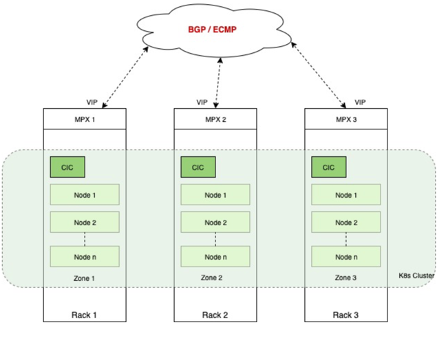
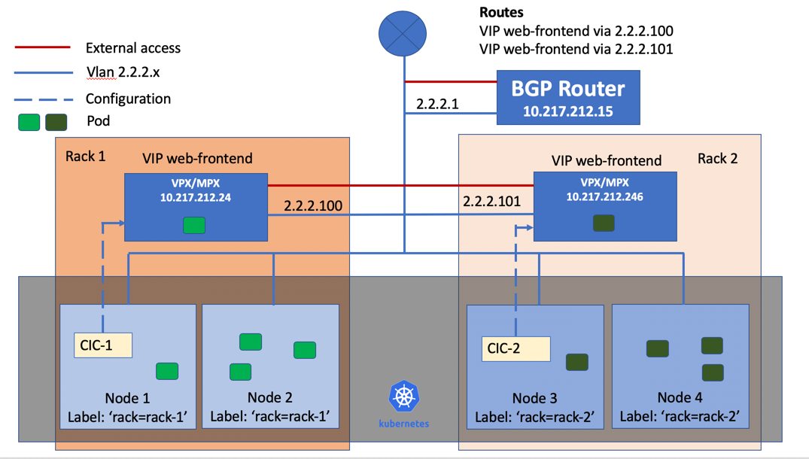

# Enhancements for Kubernetes service of type LoadBalancer support in the Citrix ingress controller

Kubernetes service of type LoadBalancer support in the Citrix ingress controller is enhanced with the following features:

- BGP route health injection (RHI) support
- Advertise or recall load balancer IP addresses (VIPs) based on the availability of service’s pods in a set of nodes (zones) defined by node’s labels
  
## Support for automatic configuration of BGP RHI on Citrix ADC

Route health injection (RHI) allows the Citrix ADC to advertise the availability of a VIP as a host route throughout the network using BGP. However, you had to manually perform the configuration on Citrix ADC to support RHI. Using Citrix ingress controllers deployed in a Kubernetes environment, you can automate the configuration on Citrix ADCs to advertise VIPs.

When a service of type `LoadBalancer` is created, the Citrix ingress controller configures a VIP on the Citrix ADC for the service. If BGP RHI support is enabled for the Citrix ingress controller, it automatically configures Citrix ADC to advertise the VIP to the BGP network.

## Advertise and recall VIPs based on the availability of pods

In the topology as shown in the following diagram, nodes in a Kubernetes cluster are physically distributed across three different racks. They are logically grouped into three zones. Each zone has a Citrix ADC MPX as the Tier-1 ADC and a Citrix ingress controller on the same in the Kubernetes cluster. Citrix ingress controllers in all zones listen to the same Kubernetes API server. So, whenever a service of type `LoadBalancer` is created, all Citrix ADCs in the cluster advertises the same IP address to the BGP fabric. Even, if there is no workload on a zone, the Citrix ADC in that zone still advertises the IP address.

 Citrix provides a solution to advertise or recall the VIP based on the availability of pods in a zone. You need to label the nodes on each zone so that the Citrix ingress controller can identify nodes belonging to the same zone. The Citrix ingress controller on each zone performs a check to see if there are pods on nodes in the zone. If there are pods on nodes in the zone, it advertises the VIP. Otherwise, it revokes the advertisement of VIP from the Citrix ADC on the zone.

## Configuring BGP RHI on Citrix ADCs using the Citrix ingress controller

This topic provides information on how to configure BGP RHI on Citrix ADCs using the Citrix ingress controller based on a sample topology. In this topology, nodes in a Kubernetes cluster are deployed across two zones. Each zone has a Citrix ADC VPX or MPX as the Tier-1 ADC and a Citrix ingress controller for configuring ADC in the Kubernetes cluster. The ADCs are peered using BGP with the upstream router.

**Prerequisites**

- You must configure Citrix ADC MPX or VPX as a BGP peer with the upstream routers.

Perform the following steps to configure BGP RHI support based on the sample topology.

1. Label nodes in each zone using the following command:

    For zone 1:

        kubectl label nodes node1 rack=rack-1
        kubectl label nodes node2 rack=rack-1

    For zone 2:

        kubectl label nodes node3 rack=rack-2
        kubectl label nodes node4 rack=rack-2

2. Configure the following environmental variables in the Citrix ingress controller configuration YAML files as follows:

    For zone 1:

        - name: "NODE_LABELS"
          value: "rack-1"
        - name: "BGP_ADVERTISEMENT"
          value: "True"

    For zone 2:

         - name: "NODE_LABELS"
           value: "rack-2"
         - name: "BGP_ADVERTISEMENT"
           value: "True"
  
    A sample `cic.yaml` file for deploying the Citrix ingress controller on zone 1 is provided as follows:

        apiVersion: v1
        kind: Pod
        metadata:
          name: cic-k8s-ingress-controller-1
          labels:
            app: cic-k8s-ingress-controller-1
        spec:
          serviceAccountName: cic-k8s-role
          containers:
          - name: cic-k8s-ingress-controller
            image: "quay.io/citrix/citrix-k8s-ingress-controller:1.21.9"

            env:
            # Set NetScaler NSIP/SNIP, SNIP in case of HA (mgmt has to be enabled)
            - name: "NS_IP"
              value: "10.217.212.24"
           # Set username for Nitro
            - name: "NS_USER"
              valueFrom:
                secretKeyRef:
                  name: nslogin
                  key: username
           # Set user password for Nitro
            - name: "NS_PASSWORD"
              valueFrom:
                secretKeyRef:
                name: nslogin
                key: password        
            - name: "EULA"
              value: "yes"
            - name: "NODE_LABELS"
              value: "rack=rack-1"
            - name: "BGP_ADVERTISEMENT"
              value: "True"
        args:
          - --ipam 
            citrix-ipam-controller
        imagePullPolicy: Always
  
3. Deploy the Citrix ingress controller using the following command.
   
    **Note:**
     You need to deploy the Citrix ingress controller on both racks (per zone).

        Kubectl create -f cic.yaml

4. Deploy a sample application using the `web-frontend-lb.yaml` file.  

       Kubectl create -f web-frontend-lb.yaml

    The content of the `web-frontend-lb.yaml` is as follows:

        apiVersion: v1
        kind: Deployment
        metadata:
          name: web-frontend
        spec:
          replicas: 4
          template:
            metadata:
              labels:
                app: web-frontend
            spec:
              containers:
              - name: web-frontend
                image: 10.217.6.101:5000/web-test:latest
                ports:
                  - containerPort: 80
                imagePullPolicy: Always

5. Create a service of type `LoadBalancer` for exposing the application.
   
        Kubectl create -f web-frontend-lb-service.yaml
    
     The content of the `web-frontend-lb-service.yaml` is as follows:

        apiVersion: v1
        kind: Service
        metadata:
          name: web-frontend
          labels:
            app: web-frontend
        spec:
          type: LoadBalancer
          ports:
          - port: 80
            protocol: TCP
            name: http
          selector:
            app: web-frontend

6. Verify the service group creation on Citrix ADCs using the following command.

        show servicegroup <service-group-name>

    Following is a sample output for the command.

        #  show servicegroup k8s-web-frontend_default_80_svc_k8s-web-frontend_default_80_svc
       
        k8s-web-frontend_default_80_svc_k8s-web-frontend_default_80_svc - TCP
        State: ENABLED	Effective State: UP	Monitor Threshold : 0
        Max Conn: 0	Max Req: 0	Max Bandwidth: 0 kbits
        Use Source IP: NO	
        Client Keepalive(CKA): NO
        TCP Buffering(TCPB): NO
        HTTP Compression(CMP): NO
        Idle timeout: Client: 9000 sec	Server: 9000 sec
        Client IP: DISABLED 
        Cacheable: NO
        SC: OFF
        SP: OFF
        Down state flush: ENABLED
        Monitor Connection Close : NONE
        Appflow logging: ENABLED
        ContentInspection profile name: ???
        Process Local: DISABLED
        Traffic Domain: 0

        1)   10.217.212.23:30126	State: UP	Server Name: 10.217.212.23	Server ID: None	Weight: 1
          Last state change was at Wed Jan 22 23:35:11 2020 
          Time since last state change: 5 days, 00:45:09.760

          Monitor Name: tcp-default 	State: UP	Passive: 0
          Probes: 86941	Failed [Total: 0 Current: 0]
          Last response: Success - TCP syn+ack received.
          Response Time: 0 millisec

        2)   10.217.212.22:30126	State: UP	Server Name: 10.217.212.22	Server ID: None	Weight: 1
          Last state change was at Wed Jan 22 23:35:11 2020 
          Time since last state change: 5 days, 00:45:09.790

          Monitor Name: tcp-default 	State: UP	Passive: 0
          Probes: 86941	Failed [Total: 0 Current: 0]
          Last response: Success - TCP syn+ack received.

7. Verify the VIP advertisement on the BGP router using the following command.

         >VTYSH
        # show ip route bgp
          B       172.29.46.78/32   [200/0] via 2.2.2.100, vlan20, 1d00h35m
                                    [200/0] via 2.2.2.101, vlan20, 1d00h35m
          Gateway of last resort is not set
