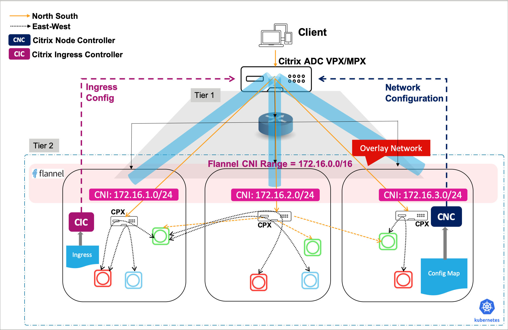

# Establish network between Kubernetes nodes and Ingress Citrix ADC using Citrix node controller

In Kubernetes environments, when you expose the services for external access through the Ingress device, to route the traffic into the cluster, you need to appropriately configure the network between the Kubernetes nodes and the Ingress device.

Configuring the network is challenging as the pods use private IP addresses based on the CNI framework. Without proper network configuration, the Ingress device cannot access these private IP addresses. Also, manually configuring the network to ensure such reachability is cumbersome in Kubernetes environments.

Also, if the Kubernetes cluster and the Ingress Citrix ADC are in different subnets, you cannot establish a route between them using [Static routing](staticrouting.md). This scenario requires an overlay mechanism to establish a route between the Kubernetes cluster and the Ingress Citrix ADC.

Citrix provides a [node controller](https://github.com/citrix/citrix-k8s-node-controller) that you can use to create a VXLAN based overlay network between the Kubernetes nodes and the Ingress Citrix ADC as shown in the following diagram:

**To establish network connectivity using Citrix node controller:**

1.  Deploy the Citrix ingress controller. Perform the following:

    1.  Download the [citrix-k8s-ingress-controller.yaml](https://github.com/citrix/citrix-k8s-ingress-controller/blob/master/deployment/baremetal/citrix-k8s-ingress-controller.yaml) using the following command:

            wget  https://raw.githubusercontent.com/citrix/citrix-k8s-ingress-controller/master/deployment/baremetal/citrix-k8s-ingress-controller.yaml

    1.  Edit the `citrix-k8s-ingress-controller.yaml` file and enter the values for the environmental variables. For more information, see [Deploy Citrix ingress controller](https://developer-docs.citrix.com/projects/citrix-k8s-ingress-controller/en/latest/deploy/deploy-cic-yaml/).

        To use Citrix node controller, you need to define a network profile (netprofile) using the `NS_NETPROFILE` environment variable in the Citrix ingress controller Deployment YAML file. The Citrix node controller uses the ***netprofile*** to establish network connectivity between the Kubernetes nodes and Ingress Citrix ADC.

                env:
                 # Set the netprofile 
                 - name: "NS_NETPROFILE"
                   value: "test-profile"

        !!! note "Note"
            Ensure that you note down the netprofile value you have provided in the `NS_NETPROFILE` environment variable.

    1.  Once you update the environment variables, save the YAML file and deploy it using the following command:

            kubectl create -f citrix-k8s-ingress-controller.yaml

    1.  Verify if the Citrix ingress controller is deployed successfully using the following command:

            kubectl get pods --all-namespaces

1.  Deploy the Citrix node controller. For information on how to deploy Citrix node controller, see [Deploy the Citrix k8s node controller](https://github.com/citrix/citrix-k8s-node-controller/blob/master/deploy/README.md)

     >**Note:**
     > Ensure that while deploying the [Citrix node controller](https://github.com/citrix/citrix-k8s-node-controller), you provide the netprofile value (for example, `test-profile`) that you have provided in the Citrix ingress controller Deployment YAML file.  
