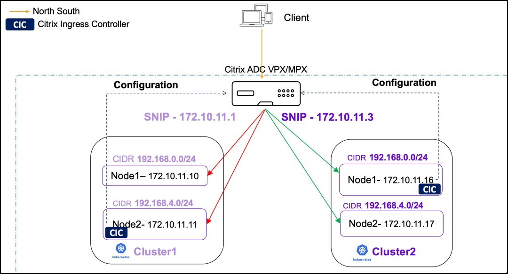

# Policy based routing support for multiple Kubernetes clusters

When you are using a single Citrix ADC to load balance multiple Kubernetes clusters, the Citrix ingress controller adds pod CIDR networks through static routes. These routes establish networking connectivity between Kubernetes pods and Citrix ADC. However, when the pod CIDRs overlap there may be route conflicts. Citrix ADC supports policy based routing (PBR) to address the networking conflicts in such scenarios. In PBR, decisions are taken based on the criteria that you specify. Typically, a next hop is specified where you send the selected packets. In a multi-cluster Kubernetes environment, PBR is implemented by reserving a subnet IP address (SNIP) for each Kubernetes cluster or the Citrix Ingress Controller. Using net profile, the SNIP is bound to all service groups created by the same Citrix ingress controller. For all the traffic generated from service groups belonging to the same cluster, the source IP address is the same SNIP.

Following is a sample topology where PBR is configured for two Kubernetes clusters which are load balanced using a Citrix ADC VPX or MPX.

## Configure PBR using the Citrix ingress controller

To configure PBR, you need one SNIP or more per Kubernetes cluster. You can provide SNIP values either using the environment variable in the Citrix ingress controller deployment YAML file during bootup or using ConfigMap.

Perform the following steps to deploy the Citrix ingress controller and configure PBR using ConfigMap.

1. Download the `citrix-k8s-ingress-controller.yaml` using the following command:

        wget  https://raw.githubusercontent.com/citrix/citrix-k8s-ingress-controller/master/deployment/baremetal/citrix-k8s-ingress-controller.yaml

2. Edit the Citrix ingress controller YAML file:
  
          - Specify the values of the environment variables as per your requirements. For more information on specifying the environment variables, see the [Deploy Citrix ingress controller](https://developer-docs.citrix.com/projects/citrix-k8s-ingress-controller/en/latest/deploy/deploy-cic-yaml/) documentation.

3. Deploy the Citrix ingress controller using the edited YAML file with the following command on each cluster.

        kubectl create -f citrix-k8s-ingress-controller.yaml

4. Create a YAML file `cic-configmap.yaml` with the required SNIP values in the ConfigMap.

    Following is an example for a ConfigMap with the SNIP values:

        
        apiVersion: v1
        kind: ConfigMap
        metadata:
            name: pbr-test
            namespace: default
        data:
            NS_SNIPS: '["192.0.2.2", "192.0.2.1"]'
        

5. Apply the ConfigMap.
   
       kubectl create -f cic-configmap.yaml

You can also specify the SNIPs using the `NS_SNIPS` environment variable in the Citrix ingress controller deployment YAML file.

         - name: "NS_SNIPS"
            value: '["192.0.2.2", "192.0.2.1"]'

The following are the usage guidelines while using ConfigMap for configuring SNIP:

- Only SNIPs can be added or removed via ConfigMap. The `feature-node-watch` argument can only be enabled during bootup.

- When you add a ConfigMap:
   
    - If SNIPs are already provided using the environment variable during bootup and you want to retain them, those SNIPs should be specified in the ConfigMap along with the new SNIPs.

- When you delete ConfigMap:
  
    - All PBRs generated by ConfigMap SNIPs are deleted. If SNIPs are provided via the environment variable, PBR for those IP addresses is added.

    - If SNIPs are not provided using the `NS_SNIPS` environment variable, static routes are added since `feature-node-watch` is enabled.

### Validate PBR configuration on a Citrix ADC after deploying the Citrix ingress controller

This validation example uses a two node Kubernetes cluster with the Citrix ingress controller deployed along with the following ConfigMap with two SNIPs.

   

You can verify that the Citrix ingress controller adds the following configurations to the ADC:

 1. An `IPset` of all `NS_SNIPs` provided by the ConfigMap is added.
 
       

 2. A net profile is added with the `SrcIP` set to the `IPset`.

       

 3. The service group added by the Citrix ingress controller contains the net profile set.

       

4. Finally, the Citrix ingress controller adds PBRs.

    
    
    Here:
    - The number of PBRs is equivalent to (number of SNIPs) * (number of Kubernetes nodes). In this case, it adds four(2*2) PBRs.
    - The `srcIP` of the PBR is the `NS_SNIPS` provided to the Citrix ingress controller by ConfigMap. The `destIP` is the CNI overlay subnet range of the Kubernetes node.
    - `NextHop` is the IP address of the Kubernetes node. 

5. You can also use the logs of the Citrix ingress controller to validate the configuration.

     

## Configure PBR using the Citrix node controller

You can configure PBR using the [Citrix node controller](https://github.com/citrix/citrix-k8s-node-controller) for multiple Kubernetes clusters. When you are using a single Citrix ADC to load balance multiple Kubernetes clusters with Citrix node controller for networking, the static routes added by it to forward packets to the IP address of the VXLAN tunnel interface may cause route conflicts. To support PBR, Citrix node controller needs to works in conjunction with the Citrix ingress controller to bind the net profile to the service group. 

Perform the following steps to configure PBR using the Citrix node controller:

1. While starting the Citrix node controller, provide the `CLUSTER_NAME` as an environment variable. Specifying this variable indicates that it is a multi-cluster deployment and the Citrix node controller configures PBR instead of static routes.  
    
    Example:

        - name: CLUSTER_NAME 
          value: "dev-cluster"

2. While deploying the Citrix ingress controller, provide the `CLUSTER_NAME` as an environment variable. This value should be the same as the value provided in Citrix node controller.

    Example:  

        - name: CLUSTER_NAME  
          value: "dev-cluster "

1. Specify the argument `--enable-cnc-pbr` as `True` in the arguments section of the Citrix ingress controller deployment YAML file. When you specify this argument, Citrix ingress controller is aware that the Citrix node controller is configuring PBR on the Citrix ADC.

    Example:

        args: 
         - --enable-cnc-pbr True          

**Note:** The value provided for `CLUSTER_NAME` in the Citrix node controller and Citrix ingress controller deployment files should match when they are deployed in the same Kubernetes cluster.

**Note:** The `CLUSTER_NAME` is used while creating the net profile entity and binding it to service groups on Citrix ADC VPX or MPX.

### Validate PBR configuration on a Citrix ADC after deploying the Citrix node controller.

This validation example uses a two node Kubernetes cluster with Citrix node controller and Citrix ingress controller deployed. 

You can verify that the following configurations are added to the ADC by Citrix node controller:

  1. A net profile is added, with the value of `srcIP` set to the SNIP added by Citrix node controller while creating the VXLAN tunnel network between the Citrix ADC and Kubernetes nodes.
  
     

  2. Citrix ingress controller binds the net profile to the service groups it creates.

     
  
  3. Finally, Citrix node controller adds PBRs.

     
     
    Here:

    - The number of PBRs is equal to number of Kuberntes nodes. In this case, it adds two PBRs.
    - The `srcIP` of the PBR is the `SNIP` added by Citrix node controller in tunnel network . The `destIP` is the CNI overlay subnet range of the Kubernete node. The `NextHop` is the IP address of Kubernetes node's VXLAN Tunnel interface. 
        

**Note:** Citrix node controller adds PBRs instead of static routes. The rest of the configuration of the VXLAN and bridge table remains the same. For more information, see the [Citrix node controller configuration](https://github.com/citrix/citrix-k8s-node-controller/tree/master/deploy#verify-the-deployment). 
