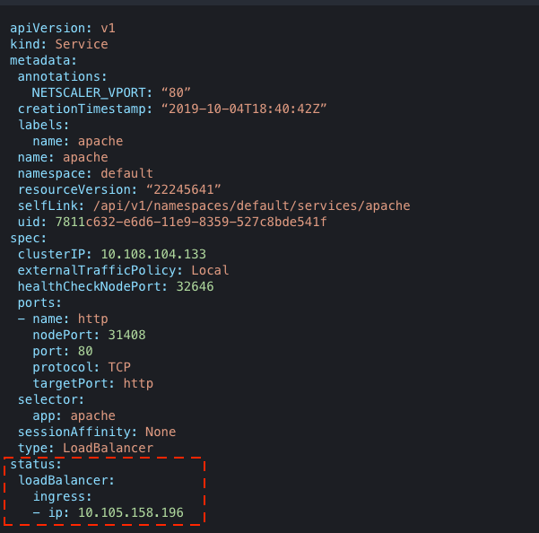
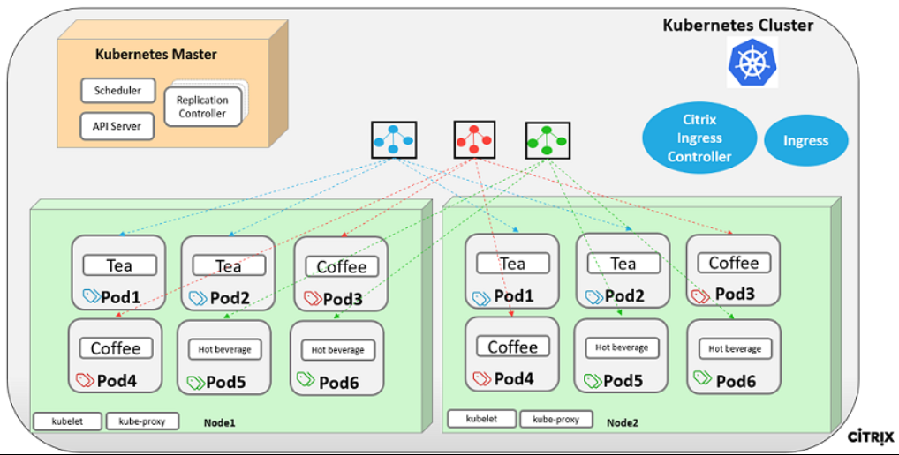
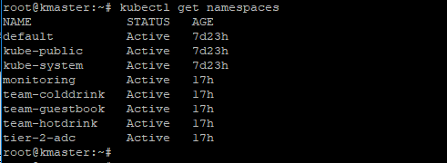
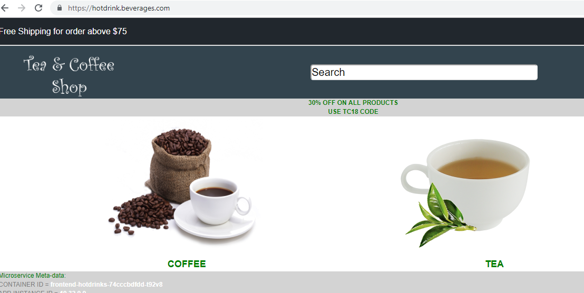

# Expose services of type LoadBalancer

Services of type `LoadBalancer` are natively supported in Kubernetes deployments on public clouds such as, AWS, GCP, or Azure. In cloud deployments, when you create a service of type LoadBalancer, a cloud managed load balancer is assigned to the service. The service is then exposed using the load balancer.

The Citrix ingress controller supports the services of type `LoadBalancer` when the Citrix ADC is outside the Kubernetes cluster (Tier-1). When a service of type `LoadBalancer` is created, updated, or deleted, the Citrix ingress controller configures the Citrix ADC with a load balancing virtual server.

The load balancing virtual server is configured with an IP address (virtual IP address or VIP) that is obtained in one of the following ways:

- By automatically assigning a virtual IP address to the service using Citrix IPAM controller. The solution is designed in such a way that you can easily integrate the solution with ExternalDNS providers such as [Infoblox](https://github.com/kubernetes-incubator/external-dns/blob/master/docs/tutorials/infoblox.md). For more information, see [Interoperability with ExternalDNS](../how-to/integrate-externaldns.md).

- By specifying An IP address using the `spec.loadBalancerIP` field in your service definition. The Citrix ingress controller uses the IP address provided in the `spec.loadBalancerIP` field as the IP address for the load balancing virtual server that corresponds to the service.  

## Expose services of type LoadBalancer with IP addresses assigned by the IPAM controller

When creating a service of type [LoadBalancer](https://kubernetes.io/docs/concepts/services-networking/service/#loadbalancer), you can use IPAM controller to automatically allocate an IP address to the service.

Citrix provides a controller called **IPAM controller** for IP address management. You must deploy the IPAM controller as a separate pod along with the Citrix ingress controller. Once the IPAM controller is deployed, it allocates IP address to services of type `LoadBalancer` from predefined IP address ranges. The Citrix ingress controller configures the IP address allocated to the service as virtual IP (VIP) in Citrix ADC MPX or VPX.

The IPAM controller requires the VIP [CustomResourceDefinition](https://kubernetes.io/docs/concepts/extend-kubernetes/api-extension/custom-resources/#customresourcedefinitions) (CRD) provided by Citrix.

When a new service of type `Loadbalancer` is created, the Citrix ingress controller creates a VIP CRD object for the service whenever the `loadBalancerIP` field in the service is empty. The IPAM controller listens for addition, deletion, or modification of the VIP CRD and updates it with an IP address. Once the VIP CRD object is updated, the Citrix ingress controller automatically configures Citrix ADC.

In this section, you deploy the IPAM controller, create a sample Deployment, create a service of type `LoadBalancer`, and access the service.

### Step 1: Deploy the IPAM controller

Before you deploy the IPAM controller, deploy the Citrix VIP CRD. For more information see, [VIP CustomResourceDefinition](../crds/vip.md).

1.  Once you deploy the Citrix VIP CRD, create a file named `cic-k8s-ingress-controller.yaml` with the following configuration:

        kind: ClusterRole
        apiVersion: rbac.authorization.k8s.io/v1beta1
        metadata:
          name: cic-k8s-role
        rules:
          - apiGroups: [""]
            resources: ["endpoints", "ingresses", "services", "pods", "secrets", "nodes", "routes", "namespaces"]
            verbs: ["get", "list", "watch"]
          # services/status is needed to update the loadbalancer IP in service status for integrating
          # service of type LoadBalancer with external-dns
          - apiGroups: [""]
            resources: ["services/status"]
            verbs: ["patch"]
          - apiGroups: ["extensions"]
            resources: ["ingresses", "ingresses/status"]
            verbs: ["get", "list", "watch"]
          - apiGroups: ["apiextensions.k8s.io"]
            resources: ["customresourcedefinitions"]
            verbs: ["get", "list", "watch"]
          - apiGroups: ["apps"]
            resources: ["deployments"]
            verbs: ["get", "list", "watch"]
          - apiGroups: ["citrix.com"]
            resources: ["rewritepolicies", "canarycrds", "authpolicies", "ratelimits"]
            verbs: ["get", "list", "watch"]
          - apiGroups: ["citrix.com"]
            resources: ["vips"]
            verbs: ["get", "list", "watch", "create", "delete"]
          - apiGroups: ["route.openshift.io"]
            resources: ["routes"]
            verbs: ["get", "list", "watch"]

        ---

        kind: ClusterRoleBinding
        apiVersion: rbac.authorization.k8s.io/v1beta1
        metadata:
          name: cic-k8s-role
        roleRef:
          apiGroup: rbac.authorization.k8s.io
          kind: ClusterRole
          name: cic-k8s-role
        subjects:
        - kind: ServiceAccount
          name: cic-k8s-role
          namespace: default

        ---

        apiVersion: v1
        kind: ServiceAccount
        metadata:
          name: cic-k8s-role
          namespace: default

        ---
        apiVersion: v1
        kind: Pod
        metadata:
          name: cic-k8s-ingress-controller
          labels:
            app: cic-k8s-ingress-controller
        spec: 
            serviceAccountName: cic-k8s-role
            containers:
            - name: cic-k8s-ingress-controller
              image: "quay.io/citrix/citrix-k8s-ingress-controller:1.3.0"
              env:
                # Set Citrix ADC NSIP/SNIP, SNIP in case of HA (mgmt has to be enabled) 
                - name: "NS_IP"
                  value: "x.x.x.x"
                # Set the username
                - name: "NS_USER"
                  valueFrom:
                    secretKeyRef:
                      name: nslogin
                      key: username
                # Set user password
                - name: "NS_PASSWORD"
                  valueFrom:
                    secretKeyRef:
                      name: nslogin
                      key: password
                # Set log level
                - name: "EULA"
                  value: "yes"
                args:
                  - --ingress-classes
                    citrix
                  - --feature-node-watch
                    false
                  - --ipam
                    citrix-ipam-controller
                imagePullPolicy: Always

2.  Deploy the Citrix ingress controller using the following command:

        kubectl create -f cic-k8s-ingress-controller.yaml

    For more information on how to deploy the Citrix ingress controller, see the [Deploy Citrix ingress controller](https://developer-docs.citrix.com/projects/citrix-k8s-ingress-controller/en/latest/deploy/deploy-cic-yaml/).

3.  Create a file named `citrix-ipam-controller.yaml` with the following configuration:

        ---
        apiVersion: v1
        kind: ServiceAccount
        metadata:
          name: citrix-ipam-controller
          namespace: kube-system
        ---
        kind: ClusterRole
        apiVersion: rbac.authorization.k8s.io/v1
        metadata:
          name: citrix-ipam-controller
        rules:
         - apiGroups:
           - citrix.com
           resources:
           - vips
           verbs:
           - '*'
        - apiGroups:
          - apiextensions.k8s.io
          resources:
          - customresourcedefinitions
          verbs:
          - '*'
        ---
        kind: ClusterRoleBinding
        apiVersion: rbac.authorization.k8s.io/v1
        metadata:
          name: citrix-ipam-controller
        subjects:
        - kind: ServiceAccount
          name: citrix-ipam-controller
          namespace: kube-system
        roleRef:
          kind: ClusterRole
          apiGroup: rbac.authorization.k8s.io
          name: citrix-ipam-controller

        ---
        apiVersion: extensions/v1beta1
        kind: Deployment
        metadata:
          name: citrix-ipam-controller
          namespace: kube-system
        spec:
          replicas: 1
          template:
            metadata:
              labels:
                app: citrix-ipam-controller
            spec:
              serviceAccountName: citrix-ipam-controller
              containers:
              - name: citrix-ipam-controller
                image: quay.io/citrix/citrix-ipam-controller:latest
                env:
                # This IPAM controller takes environment variable VIP_RANGE. IPs in this range are used to assign values for IP range
              - name: "VIP_RANGE"
                value: '["10.105.158.195/32", "10.105.158.196/31", "10.105.158.198"]'
                # The IPAM controller can also be configured with name spaces for which it would work through the environment variable
                # VIP_NAMESPACES, This expects a set of namespaces passed as space separated string

    The manifest contains two environment variables, `VIP_RANGE` or `VIP_NAMESPACES`. For more information, see [VIP_RANGE](#viprange) and [VIP_NAMESPACES](#vipnamespaces). Update the `VIP_RANGE` or `VIP_NAMESPACES` environment variables based on your requirement.

4.  Deploy the IPAM controller using the following command:

        kubectl create -f citrix-ipam-controller.yaml

#### VIP_RANGE

The `VIP_RANGE` environment variable allows you to define the IP address range. You can either define IP address range or an IP address range associated with a unique name.

##### IP address range

You can define the IP address range from a subnet or multiple subnets. Also, you can use the `-` character to define the IP address range. The IPAM controller assigns the IP address from this IP address range to the service.

The following examples demonstrate the various ways you can define the IP address range in the `VIP_RANGE` environment variable:

    To define the IP address range from a subnet:

        - name: "VIP_RANGE"
          value: '["10.xxx.xxx.18/31"]'

    To define the IP address range from multiple subnets, ensure that the values are valid CIDRs for the subnets:

        - name: "VIP_RANGE"
          value: '["10.217.212.18/31",  "10.217.212.20/31", "10.217.212.16/30", "10.217.212.0/24"]'

    Also, you can use dash (`-`) to define the IP address range:

        - name: "VIP_RANGE"
          value: '["10.217.212.18 - 10.217.212.21",  “10.217.212.27 - 10.217.212.31",  “10.217.213.24 - 10.217.213.32" ]'

##### IP address range associated with a unique name

You can assign a unique name to the IP address range and define the range in the `VIP_RANGE` environment variable. This way of assigning the IP address range enables you to differentiate between the IP address ranges. When you create the services of type `LoadBalancer` you can use the `service.citrix.com/ipam-range` annotation in the service definition to specify the IP address range to use for IP address allocation.

For example, there are three domains namely, `Dev`, `Test`, and `Prod` that have dedicated workloads to manage. If each team wants a separate range of IP addresses to load balance the microservice traffic, you can assign unique names to the IP address ranges. Then, you can define the names in the `service.citrix.com/ipam-range` annotation in your service definition. The service defined with `service.citrix.com/ipam-range = 'Dev'` is allocated with an IP address from the IP address range associated with `Dev`.

The following examples demonstrate the various ways you can define the IP address range associated with a unique name in the `VIP_RANGE` environment variable:

        - name: "VIP_RANGE"
          value: '[{"Prod": ["10.1.2.0/24"]}, {"Test": ["10.1.3.0/24"]}, {"Dev": ["10.1.4.0/24", "10.1.5.0/24"]},["10.1.6.0/24"]]'

Also, you can use `-` character to define the IP address range:

        - name: "VIP_RANGE"
          value: '[{"Prod": ["10.1.2.0 - 10.1.2.255"]}, {"Test": ["10.1.3.0 - 10.1.3.255"]}, {"Dev": ["10.1.4.0/24", "10.1.5.0/24"]},["10.1.6.0/24"]]'

The following is a sample service definition for demonstrating the usage of the `service.citrix.com/ipam-range` annotation. In this example, the annotation is used to allocate IP address from the IP address range associated with a unique name `Dev` to the service.

```yml

apiVersion: v1
kind: Service
metadata:
  annotations:
    service.citrix.com/ipam-range: "Dev"
  name: apache
  labels:
      name: apache
spec:
  externalTrafficPolicy: Local
  type: LoadBalancer
  selector:
      name: apache
  ports:
    - name: http
      port: 80
      targetPort: http
  selector:
      app: apache
      
```

#### VIP_NAMESPACES

The `VIP_NAMESPACES` environment variable enables you to define the IPAM controller to work only for a set of namespaces. The IPAM controller allocates IP addresses to the services created only from the namespaces specified in the environment variable.

The following example demonstrates how you can specify the namespaces in the `VIP_NAMESPACES` environment variable:

        - name: "VIP_NAMESPACES"
          value: 'default kube-system'

The IPAM controller allocates IP addresses to the services created from `default` and `kube-system` namespaces.

> **Note**
> If you do not use the `VIP_NAMESPACES` environment variable or do not set a value, then the IPAM controller allocates IP addresses to services created from all namespaces.

### Step 2: Deploy the Apache microservice application

Deploy an `apache` application in your Kubernetes cluster.

1. Create a file named `apache-deployment.yaml` with the following configuration:
    ```yml

    apiVersion: apps/v1beta2
    kind: Deployment
    metadata:
      name: apache
      labels:
        name: apache
    spec:
      selector:
        matchLabels:
          app: apache
      replicas: 8
      template:
        metadata:
          labels:
            app: apache
        spec:
          containers:
            - name: apache
              image: httpd:latest
              ports:
               - name: http
                 containerPort: 80
              imagePullPolicy: IfNotPresent
    ```

2. Deploy the `apache` application using the following command:

        kubectl create -f apache-deployment.yaml

3.  Verify if eight Pods are running using the following:

        kubectl get pods

    Output:

        NAME                      READY   STATUS   RESTARTS   AGE
        apache-7db8f797c7-2x6jc   1/1     Running   0          8s
        apache-7db8f797c7-cdgmw   1/1     Running   0          8s
        apache-7db8f797c7-lh447   1/1     Running   0          8s
        apache-7db8f797c7-m7mhd   1/1     Running   0          8s
        apache-7db8f797c7-m9rn7   1/1     Running   0          8s
        apache-7db8f797c7-r9jgz   1/1     Running   0          8s
        apache-7db8f797c7-vwhc8   1/1     Running   0          8s
        apache-7db8f797c7-zslwv   1/1     Running   0          8s

### Step 3: Expose the Apache microservice using service of type LoadBalancer

Create a service (`apache`) of type `LoadBalancer`.

1. Create a file named `apache-service.yaml` with the following configuration:

    ```yml

    apiVersion: v1
    kind: Service
    metadata:
      name: apache
      labels:
        name: apache
    spec:
      externalTrafficPolicy: Local
      loadBalancerIP: "110.217.212.16"
      type: LoadBalancer
      selector:
        name: apache
      ports:
        - name: http
          port: 80
          targetPort: http
      selector:
        app: apache
    ```

2.  Deploy the service using the following command:

        kubectl create -f apache-service.yaml

    When you create the service (`apache`) of type `LoadBalancer`, the IPAM controller assigns an IP address to the `apache` service from the IP address range you had defined in the IPAM controller deployment. The IP address allocated by the IPAM controller is provided in the `status.loadBalancer.ingress:` field of the service definition. The Citrix ingress controller configures the IP address allocated to the service as virtual IP (VIP) in Citrix ADC.

3.  View the service using the following command:

        kubectl get service apache --output yaml

    Output:

    

### Step 4: Access the service

You can access the `apache` service using the IP address assigned by IPAM controller to the service. You can find the IP address in the `status.loadBalancer.ingress:` field of the service definition. Use the `curl` command to access the service:

    curl <IP_address>

The response should be:

    <html><body><h1>It works!</h1></body></html>

## Expose services of type LoadBalancer by specifying an IP address

Create a service of type [LoadBalancer](https://kubernetes.io/docs/concepts/services-networking/service/#loadbalancer), in your service definition file, specify `spec.type:LoadBalancer` and specify an IP address in the `spec.loadBalancerIP` field.

When you create a service of type [LoadBalancer](https://kubernetes.io/docs/concepts/services-networking/service/#loadbalancer), the Citrix ingress controller configures the IP address you have defined in the `spec.loadBalancerIP` field as virtual IP (VIP) in Citrix ADC.

### **Example:** Expose an Apache application using service of type LoadBalancer

Perform the following:

1.  Deploy the `apache` application. Create a file named `apache-deployment.yaml` with the following configuration:

    ```yml
    apiVersion: apps/v1beta2
    kind: Deployment
    metadata:
      name: apache
      labels:
        name: apache
      spec:
        selector:
          matchLabels:
            app: apache
        replicas: 8
        template:
          metadata:
           labels:
              app: apache
          spec:
           containers:
              - name: apache
                image: httpd:latest
                ports:
                  - name: http
                    containerPort: 80
                imagePullPolicy: IfNotPresent
          
    ```

2. Deploy the `apache` application using the following command:

        kubectl create -f apache-deployment.yaml

3. Verify if eight pods are running using the following:

        kubectl get pods

    Output:

        NAME                      READY   STATUS   RESTARTS   AGE
        apache-7db8f797c7-2x6jc   1/1     Running   0          8s
        apache-7db8f797c7-cdgmw   1/1     Running   0          8s
        apache-7db8f797c7-lh447   1/1     Running   0          8s
        apache-7db8f797c7-m7mhd   1/1     Running   0          8s
        apache-7db8f797c7-m9rn7   1/1     Running   0          8s
        apache-7db8f797c7-r9jgz   1/1     Running   0          8s
        apache-7db8f797c7-vwhc8   1/1     Running   0          8s
        apache-7db8f797c7-zslwv   1/1     Running   0          8s

4. Create a service (`apache`) of type `LoadBalancer`. Create a file name `apache-service.yaml` with the following configuration:

        apiVersion: v1
        kind: Service
        metadata:
          name: apache
          labels:
            name: apache
        spec:
          externalTrafficPolicy: Local
          loadBalancerIP: "110.217.212.16"
          type: LoadBalancer
          selector:
            name: apache
          ports:
            - name: http
              port: 80
              targetPort: http
          selector:
            app: apache

5. Deploy the service using the following command:

        kubectl create -f apache-service.yaml

    When you create the service (`apache`), the Citrix ingress controller configures `10.217.212.16` as virtual IP address (VIP) in Citrix ADC VPX.

6. Access the `apache` service using the IP address (`10.217.212.16`) that you had assigned to the service. Use the `curl` command to access the service:

        curl 10.217.212.16

    The response should be:

        <html><body><h1>It works!</h1></body></html>

## **Example use case:** Expose microservices using services of type LoadBalancer in a Citrix ADC dual-tier deployment

This example shows how to expose microservices using services of type LoadBalancer in a Citrix ADC [dual-tier](../deployment-topologies#dual-tier-topology) deployment.

Citrix ADC in a [dual-tier](../deployment-topologies#dual-tier-topology) deployment solution enables you to expose microservices deployed in Kubernetes to clients outside the cluster. You can deploy Citrix ADC VPX, MPX, or CPX as a load balancer in Tier-1 to manage high scale North-South traffic to the microservices. In Tier-2, you can deploy Citrix ADC CPX as an intelligent L7 microservices router for North-South and East-West traffic. In this example, a Citrix ADC VPX (service of type `LoadBalancer`) is used in Tier-1 and a Citrix ADC CPX (Ingress) is used in Tier-2.

The following diagram depicts the microservice deployment used in this example. The deployment contains three services that are highlighted in blue, red, and green colors respectively. The deployment contains 12 pods running across two worker nodes. These deployments are logically categorized by Kubernetes namespace (for example, team-hotdrink namespace).



### Prerequisites

Ensure that you have:

- Deployed a Kubernetes cluster. For more information, see [https://kubernetes.io/docs/setup/scratch/](https://kubernetes.io/docs/setup/scratch/).
- Set up the Kubernetes dashboard for deploying containerized applications. For more information, see [https://kubernetes.io/docs/tasks/access-application-cluster/web-ui-dashboard/](https://kubernetes.io/docs/tasks/access-application-cluster/web-ui-dashboard/).
- The route configuration present in Tier-1 Citrix ADC so that the Ingress Citrix ADC is able to reach the Kubernetes pod network for seamless connectivity. For detailed instructions, see [manually configure a route on the Citrix ADC instance](staticrouting.md#manually-configure-route-on-the-citrix-adc-instance).

### Deploy microservices using Kubernetes service of type LoadBalancer solution

1. Clone the GitHub repository to your Master node using following command:

        git clone https://github.com/citrix/example-cpx-vpx-for-kubernetes-2-tier-microservices.git

2. Using the master nodes' CLI console, create namespaces using the following command:

        kubectl create -f namespace.yaml

    Verify if the namespaces are created in your Kubernetes cluster using the following command:

        kubectl get namespaces

    The output of the command should be:

    

3. From the Kubernetes dashboard, deploy the `rbac.yaml` in the default namespace using the following command:

        kubectl create -f rbac.yaml 

4. Deploy the IPAM CRD and IPAM controller for automatically assigning IP addresses to the Kubernetes services. Use the following command:

        kubectl create -f vip.yaml
        kubectl create -f ipam_deploy.yaml

5. Deploy the Citrix ADC CPX for `hotdrink`,`colddrink`, and `guestbook` microservices using following commands:

        kubectl create -f cpx.yaml -n tier-2-adc
        kubectl create -f hotdrink-secret.yaml -n tier-2-adc

6. Deploy three types of `hotdrink` beverage microservices using following commands:

        kubectl create -f team_hotdrink.yaml -n team-hotdrink
        kubectl create -f hotdrink-secret.yaml -n team-hotdrink

7. Deploy the `colddrink` beverage microservice using following commands:

        kubectl create -f team_colddrink.yaml -n team-colddrink
        kubectl create -f colddrink-secret.yaml -n team-colddrink

8. Deploy the `guestbook` no SQL type microservice using following commands:

        kubectl create -f team_guestbook.yaml -n team-guestbook

9. Log on to Tier-1 Citrix ADC to verify if no configuration is pushed from the Citrix ingress controller before automating the Tier-1 Citrix ADC.

10. Deploy the Citrix ingress controller to push the Citrix ADC CPX configuration to the Tier-1 Citrix ADC automatically. In the `cic_vpx.yaml`, change the value of the NS_IP environment variable with your Citrix ADC VPX NS_IP. For more information on the Citrix ingress controller deployment, see [Deploy the Citrix ingress controller using YAML](../deploy/deploy-cic-yaml.md).
    
    After you update the `cic_vpx.yaml` file, deploy the file using the following command:

        kubectl create -f cic_vpx.yaml -n tier-2-adc

11. Verify if the IPAM controller has assigned the IP addresses to the Citrix ADC CPX services. Use the following command:

        kubectl get svc -n tier-2-adc

12. Add the following DNS entries in your local machine host files to access the microservices using Internet:

        <frontend-ip from ingress_vpx.yaml> hotdrink.beverages.com
        <frontend-ip from ingress_vpx.yaml> colddrink.beverages.com
        <frontend-ip from ingress_vpx.yaml> guestbook.beverages.com

You can now access the microservices using the following URL: [https://hotdrink.beverages.com](https://hotdrink.beverages.com)


