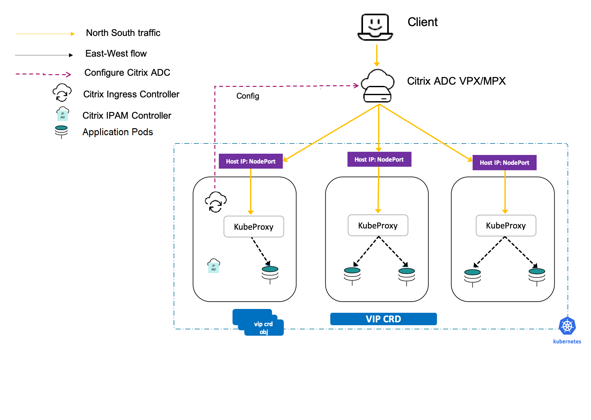

# Expose services of type LoadBalancer

In a Kubernetes environment, a microservice is deployed as a set of pods that are created and destroyed dynamically. Since the set of pods that refer to a microservice are constantly changing, Kubernetes
provides a logical abstraction known as service to expose your microservice running on a set of pods. A service defines a logical set of pods, as well as policies to access them.

A service of type [LoadBalancer](https://kubernetes.io/docs/concepts/services-networking/service/#loadbalancer) is the simplest way to expose a microservice inside a Kubernetes cluster to the external world. Services of type LoadBalancer are natively supported in Kubernetes deployments on public clouds such as, AWS, GCP, or Azure. In cloud deployments, when you create a service of type LoadBalancer, a cloud managed load balancer is assigned to the service. The service is then exposed using the load balancer.

There may be several situations where you want to deploy your Kubernetes cluster on bare metal or on-premises rather than deploy it on public cloud. When you are running your applications on bare metal Kubernetes clusters, it is much easier to route TCP or UDP traffic using a service of type `LoadBalancer` than using Ingress. Even for HTTP traffic, it is sometimes more convenient than Ingress. However, there is no load balancer implementation natively available for bare metal Kubernetes clusters. Citrix provides a way to load balance such services using the Citrix ingress controller and Citrix ADC.

In the Citrix solution for services of type `LoadBalancer`, the Citrix ingress controller deployed inside the Kubernetes cluster configures a Citrix ADC deployed outside the cluster to load balance the incoming traffic. Using the Citrix solution, you can load balance the incoming traffic to the Kubernetes cluster regardless of whether the deployment is on bare metal, on-premises, or public cloud. Since the Citrix ingress controller provides flexible IP address management that enables multi-tenancy for Citrix ADCs, you can use a single Citrix ADC to load balance multiple services as well as to perform Ingress functions. Hence, you can maximize the utilization of load balancer resources and significantly reduce your operational expenses.

**Services of type LoadBalancer VS Kubernetes Ingress**

The following table summarizes a comparison between the Kubernetes Ingress and services of type LoadBalancer that helps you to choose the right option based on your requirements:

| Services of type `LoadBalancer` | Ingress |
| -------------------            | -------- |
| Simpler and faster way to expose a service. You only need to specify the service type as `type=LoadBalancer` in the service definition.     |  Ingress provides advanced features but implementation requires more steps. You need to write an Ingress object in addition to the service definition. Also, the chances of making mistakes while defining the Ingress is more. |
| Needs a separate IP address for each service.  | Provides a way to expose multiple services using a single IP address. |
| Forwards all kinds of traffic arriving on the specified port to the service regardless of it is HTTP, TCP, or UDP. There is no filtering or options to perform advanced routing.| Feature rich and powerful compared to services of type LoadBalancer. Ingress provides multiple routing options. For example, using ingress you can perform path-based and sub domain-based routing to back-end services. |

## How does the Citrix solution for services of type LoadBalancer work on bare-metal clusters

By default, a service of type `LoadBalancer` simply exposes NodePorts for the service in a bare-metal Kubernetes cluster. It does not configure external load balancers.

Citrix offers an end-to-end solution for services of type `LoadBalancer` in a bare-metal Kubernetes cluster by providing both IP management and external load balancer configuration.

With the Citrix solution, when a service of type `LoadBalancer` is created in the bare-metal cluster, the Citrix ingress controller configures the Citrix ADC outside the Kubernetes cluster (Tier-1) with a load balancing virtual server.

The load balancing virtual server is configured with an IP address either automatically assigned by the Citrix [IPAM controller](#ip-address-management-using-the-ipam-controller) or manually specified in the service definition using the `spec.loadBalancerIP` field. Once the IP address is configured for a service, you can use the configured IP address to access the service externally.

### IP address management using the IPAM controller

The IPAM controller is a container provided by Citrix for IP address management and it runs in parallel to the Citrix ingress controller a pod in the Kubernetes cluster. For services of type [LoadBalancer](https://kubernetes.io/docs/concepts/services-networking/service/#loadbalancer), you can use the IPAM controller to automatically allocate IP addresses to services from a specified IP address range. You can specify this IP range in the YAML file while deploying the IPAM controller using YAML. The Citrix ingress controller configures the IP address allocated to the service as a virtual IP address (VIP) in Citrix ADC MPX or VPX.
Using this IP address, you can externally access the service.

The IPAM controller requires the VIP [CustomResourceDefinition](https://kubernetes.io/docs/concepts/extend-kubernetes/api-extension/custom-resources/#customresourcedefinitions) (CRD) provided by Citrix. The VIP CRD contains fields for service-name, namespace, and IP address. The VIP CRD is used for internal communication between the Citrix ingress controller and the IPAM controller.

The following diagram shows a deployment of service type load balancer where the IPAM controller is used to assign an IP address to a service.



When a new service of type `Loadbalancer` is created, the following events occur:

  1. The Citrix ingress controller creates a VIP CRD object for the service whenever the `loadBalancerIP` field in the service is empty.
  2. The IPAM controller assigns an IP address for the VIP CRD object.
  3. Once the VIP CRD object is updated with the IP address, the Citrix ingress controller automatically configures the Citrix ADC.

**Note:** Custom resource definitions (CRDs) offered by Citrix also supports services of type `LoadBalancer`. That means, you can specify a service of type `LoadBalancer` as a service name when you create a CRD object and apply the CRD to the service.

The IPAM controller solution is designed in such a way that you can easily integrate the solution with ExternalDNS providers such as [Infoblox](https://github.com/kubernetes-incubator/external-dns/blob/master/docs/tutorials/infoblox.md). For more information on ExternalDNS, see [Interoperability with ExternalDNS](../how-to/integrate-externaldns.md).

## Expose services of type LoadBalancer with IP addresses assigned by the IPAM controller

This topic provides information on how to expose services of type LoadBalancer with IP addresses assigned by the IPAM controller.

To expose a service of type load balancer with an IP address from the IPAM controller, perform the following steps:

  1. Deploy the VIP CRD
  2. Deploy the Citrix ingress controller
  3. Deploy the IPAM controller.
  4. Deploy a sample application.
  5. Create a service of type `LoadBalancer` to expose the application.
  6. Access the service.

### Step1: Deploy the VIP CRD

Perform the following step to deploy the Citrix VIP CRD which enables communication between the Citrix ingress controller and the IPAM controller.


     kubectl create -f https://raw.githubusercontent.com/citrix/citrix-k8s-ingress-controller/master/crd/vip/vip.yaml

 For more information on VIP CRD see, the [VIP CustomResourceDefinition](../crds/vip.md).

### Step2: Deploy the Citrix ingress controller

Perform the following steps to deploy the Citrix ingress controller with the IPAM controller argument.

1. Download the `citrix-k8s-ingress-controller.yaml` using the following command:

        wget  https://raw.githubusercontent.com/citrix/citrix-k8s-ingress-controller/master/deployment/baremetal/citrix-k8s-ingress-controller.yaml

2. Edit the Citrix ingress controller YAML file:
  
    - Specify the values of the environment variables as per your requirements. For more information on specifying the environment variables, see the [Deploy Citrix ingress controller](https://developer-docs.citrix.com/projects/citrix-k8s-ingress-controller/en/latest/deploy/deploy-cic-yaml/).

    - Specify the IPAM controller as an argument using the following:

              args:
              - --ipam
                citrix-ipam-controller

     Here is a snippet of a sample Citrix ingress controller YAML file with the IPAM controller argument:

     **Note:** This YAML is for demonstration purpose only and not the full version. Always, use the latest version of the YAML and edit as per your requirements.

      ```    
      apiVersion: v1
      kind: Pod
      metadata:
        name: cic-k8s-ingress-controller
        labels:
          app: cic-k8s-ingress-controller
      spec: 
        serviceAccountName: cic-k8s-role
        containers:
        - name: cic-k8s-ingress-controller
          image: "quay.io/citrix/citrix-k8s-ingress-controller:1.3.0"
          env:
          # Set Citrix ADC NSIP/SNIP, SNIP in case of HA (mgmt has to be enabled) 
            - name: "NS_IP"
              value: "x.x.x.x"
              # Set the username
            - name: "NS_USER"
              valueFrom:
                secretKeyRef:
                  name: nslogin
                  key: username
              # Set user password
            - name: "NS_PASSWORD"
              valueFrom:
                secretKeyRef:
                  name: nslogin
                  key: password
              # Set log level
            - name: "EULA"
              value: "yes"
          args:
            - --ingress-classes
              citrix
            - --feature-node-watch
              false
            - --ipam
              citrix-ipam-controller
          imagePullPolicy: Always
      ```

3. Deploy the Citrix ingress controller using the edited YAML file with the following command;

        kubectl create -f citrix-k8s-ingress-controller.yaml

    For more information on how to deploy the Citrix ingress controller, see the [Deploy Citrix ingress controller](https://developer-docs.citrix.com/projects/citrix-k8s-ingress-controller/en/latest/deploy/deploy-cic-yaml/).

### Step3: Deploy the IPAM controller

Perform the following steps to deploy the IPAM controller.

1. Create a file named `citrix-ipam-controller.yaml` with the following configuration:

        ---
        apiVersion: v1
        kind: ServiceAccount
        metadata:
          name: citrix-ipam-controller
          namespace: kube-system
        ---
        kind: ClusterRole
        apiVersion: rbac.authorization.k8s.io/v1
        metadata:
          name: citrix-ipam-controller
        rules:
         - apiGroups:
           - citrix.com
           resources:
           - vips
           verbs:
           - '*'
        - apiGroups:
          - apiextensions.k8s.io
          resources:
          - customresourcedefinitions
          verbs:
          - '*'
        ---
        kind: ClusterRoleBinding
        apiVersion: rbac.authorization.k8s.io/v1
        metadata:
          name: citrix-ipam-controller
        subjects:
        - kind: ServiceAccount
          name: citrix-ipam-controller
          namespace: kube-system
        roleRef:
          kind: ClusterRole
          apiGroup: rbac.authorization.k8s.io
          name: citrix-ipam-controller

        ---
        apiVersion: extensions/v1beta1
        kind: Deployment
        metadata:
          name: citrix-ipam-controller
          namespace: kube-system
        spec:
          replicas: 1
          template:
            metadata:
              labels:
                app: citrix-ipam-controller
            spec:
              serviceAccountName: citrix-ipam-controller
              containers:
              - name: citrix-ipam-controller
                image: quay.io/citrix/citrix-ipam-controller:latest
                env:
                # This IPAM controller takes environment variable VIP_RANGE. IPs in this range are used to assign values for IP range
              - name: "VIP_RANGE"
                value: '["10.105.158.195/32", "10.105.158.196/31", "10.105.158.198"]'
                # The IPAM controller can also be configured with name spaces for which it would work through the environment variable
                # VIP_NAMESPACES, This expects a set of namespaces passed as space separated string

    The manifest contains two environment variables, `VIP_RANGE` and `VIP_NAMESPACES`. You can specify the appropriate routable IP range with a valid CIDR under the `VIP_RANGE`. If necessary, you can also specify a set of namespaces under  `VIP_NAMESPACES`  so that the IPAM controller allocates addresses only for services from specific namespaces.

    For more information, see [VIP_RANGE](#vip_range) and [VIP_NAMESPACES](#vip_namespaces).

2. Deploy the IPAM controller using the following command:

        kubectl create -f citrix-ipam-controller.yaml

### Step 4: Deploy a sample application

Perform the following to deploy an `apache` application in your Kubernetes cluster.

**Note:** In this example, an `apache` application is used. You can deploy a sample application of your choice.

1. Create a file named `apache-deployment.yaml` with the following configuration:


        apiVersion: apps/v1beta2
        kind: Deployment
        metadata:
          name: apache
          labels:
           name: apache
        spec:
          selector:
            matchLabels:
              app: apache
          replicas: 8
          template:
            metadata:
              labels:
                app: apache
            spec:
              containers:
              - name: apache
                image: httpd:latest
                ports:
                - name: http
                  containerPort: 80
                imagePullPolicy: IfNotPresent

2. Deploy the `apache` application using the following command:

        kubectl create -f apache-deployment.yaml

3.  Verify if the pods are running using the following:

        kubectl get pods

    Output:

        NAME                      READY   STATUS   RESTARTS   AGE
        apache-7db8f797c7-2x6jc   1/1     Running   0          8s
        apache-7db8f797c7-cdgmw   1/1     Running   0          8s
        apache-7db8f797c7-lh447   1/1     Running   0          8s
        apache-7db8f797c7-m7mhd   1/1     Running   0          8s
        apache-7db8f797c7-m9rn7   1/1     Running   0          8s
        apache-7db8f797c7-r9jgz   1/1     Running   0          8s
        apache-7db8f797c7-vwhc8   1/1     Running   0          8s
        apache-7db8f797c7-zslwv   1/1     Running   0          8s

### Step 5: Expose the sample application using service of type LoadBalancer

Perform the following to create a service (`apache`) of type `LoadBalancer`.

1. Create a file named `apache-service.yaml` with the following configuration:


        apiVersion: v1
        kind: Service
        metadata:
          name: apache
          labels:
            name: apache
        spec:
          externalTrafficPolicy: Local
          loadBalancerIP: "110.217.212.16"
          type: LoadBalancer
          selector:
            name: apache
          ports:
          - name: http
            port: 80
            targetPort: http
          selector:
            app: apache

2.  Deploy the service using the following command:

        kubectl create -f apache-service.yaml

    When you create the service, the IPAM controller assigns an IP address to the `apache` service from the IP address range you had defined in the IPAM controller deployment. The IP address allocated by the IPAM controller is provided in the `status.loadBalancer.ingress:` field of the service definition. The Citrix ingress controller configures the IP address allocated to the service as a virtual IP (VIP) in the Citrix ADC.

3.  View the service using the following command:

        kubectl get service apache --output yaml

    Output:

    

### Step 6: Access the service

You can access the `apache` service using the IP address assigned by the IPAM controller to the service. You can find the IP address in the `status.loadBalancer.ingress:` field of the service definition. Use the `curl` command to access the service:

    curl <IP_address>

The response should be:

    <html><body><h1>It works!</h1></body></html>

## Expose services of type LoadBalancer by specifying an IP address

You can also expose a service of type LoadBalancer manually by specifying an IP address in your service definition.

 To expose a service of type LoadBalancer manually, you can specify the IP address in the service definition YAML file as follows.

    spec:
      type: LoadBalancer
      loadBalancerIP: "<ip-address>"

When you create a service of type [LoadBalancer](https://kubernetes.io/docs/concepts/services-networking/service/#loadbalancer), the Citrix ingress controller configures the IP address you have defined in the `spec.loadBalancerIP` field as a virtual IP (VIP) address in Citrix ADC.

### **Example:** Expose an Apache application using service of type LoadBalancer

Perform the following:

1. Create a file named `apache-deployment.yaml` with the following configuration:
   

        apiVersion: apps/v1beta2
        kind: Deployment
        metadata:
          name: apache
          labels:
            name: apache
        spec:
          selector:
            matchLabels:
              app: apache
          replicas: 8
          template:
            metadata:
              labels:
                app: apache
            spec:
              containers:
              - name: apache
                image: httpd:latest
                ports:
                - name: http
                  containerPort: 80
                imagePullPolicy: IfNotPresent
    

2. Deploy the `apache` application using the following command:

        kubectl create -f apache-deployment.yaml

3. Verify if the pods are running using the following:

        kubectl get pods

    Output:

        NAME                      READY   STATUS   RESTARTS   AGE
        apache-7db8f797c7-2x6jc   1/1     Running   0          8s
        apache-7db8f797c7-cdgmw   1/1     Running   0          8s
        apache-7db8f797c7-lh447   1/1     Running   0          8s
        apache-7db8f797c7-m7mhd   1/1     Running   0          8s
        apache-7db8f797c7-m9rn7   1/1     Running   0          8s
        apache-7db8f797c7-r9jgz   1/1     Running   0          8s
        apache-7db8f797c7-vwhc8   1/1     Running   0          8s
        apache-7db8f797c7-zslwv   1/1     Running   0          8s


4. Create a service (`apache`) of type `LoadBalancer`. Create a file name `apache-service.yaml` with the following configuration:


        apiVersion: v1
        kind: Service
        metadata:
          name: apache
          labels:
            name: apache
        spec:
          externalTrafficPolicy: Local
          loadBalancerIP: "110.217.212.16"
          type: LoadBalancer
          selector:
            name: apache
          ports:
            - name: http
              port: 80
              targetPort: http
          selector:
            app: apache


5. Deploy the service using the following command:

        kubectl create -f apache-service.yaml

    When you create the service (`apache`), the Citrix ingress controller configures `10.217.212.16` as a virtual IP address (VIP) in Citrix ADC VPX.

6. Access the `apache` service using the IP address (`10.217.212.16`) that you had assigned to the service. Use the `curl` command to access the service:

        curl 10.217.212.16

    The response should be:

        <html><body><h1>It works!</h1></body></html>

## **Example use case:** Expose microservices using services of type LoadBalancer in a Citrix ADC dual-tier deployment

This example shows how to expose microservices deployed in Kubernetes to clients outside the cluster using services of type LoadBalancer in a Citrix ADC [dual-tier](../deployment-topologies#dual-tier-topology) deployment.

You can deploy Citrix ADC VPX, MPX, or CPX as a load balancer in Tier-1 to manage high scale North-South traffic to the microservices. In Tier-2, you can deploy Citrix ADC CPX as an intelligent L7 microservices router for North-South and East-West traffic. In this example, a Citrix ADC VPX (service of type `LoadBalancer`) is used in Tier-1 and a Citrix ADC CPX (Ingress) is used in Tier-2.

The following diagram depicts the microservice deployment in this example. The deployment contains three services that are highlighted in blue, red, and green colors respectively. The deployment contains 12 pods running across two worker nodes. These deployments are logically categorized using Kubernetes namespaces.


### Prerequisites

Ensure that you have:

- Deployed a Kubernetes cluster. For more information, see [https://kubernetes.io/docs/setup/scratch/](https://kubernetes.io/docs/setup/scratch/).
- Set up the Kubernetes dashboard for deploying containerized applications. For more information, see [https://kubernetes.io/docs/tasks/access-application-cluster/web-ui-dashboard/](https://kubernetes.io/docs/tasks/access-application-cluster/web-ui-dashboard/).
- The route configuration present in the Tier-1 Citrix ADC so that the Ingress Citrix ADC is able to reach the Kubernetes pod network for seamless connectivity. For detailed instructions, see [manually configure a route on the Citrix ADC instance](staticrouting.md#manually-configure-route-on-the-citrix-adc-instance).

### Deploy microservices using Kubernetes service of type LoadBalancer solution

1. Clone the GitHub repository to your master node using the following command:

        git clone https://github.com/citrix/example-cpx-vpx-for-kubernetes-2-tier-microservices.git

2. Using the CLI console of the master node, create namespaces using the following command:

        kubectl create -f namespace.yaml

    Verify if the namespaces are created in your Kubernetes cluster using the following command:

        kubectl get namespaces

    The output of the command should be:

    

3. From the Kubernetes dashboard, deploy the `rbac.yaml` in the default namespace using the following command:

        kubectl create -f rbac.yaml 

4. Deploy the VIP CRD and IPAM controller for automatically assigning IP addresses to the Kubernetes services. Use the following command:

        kubectl create -f vip.yaml
        kubectl create -f ipam_deploy.yaml

5. Deploy the Citrix ADC CPX for `hotdrink`, `colddrink`, and `guestbook` microservices using the following commands:

        kubectl create -f cpx.yaml -n tier-2-adc
        kubectl create -f hotdrink-secret.yaml -n tier-2-adc

6. Deploy three types of `hotdrink` beverage microservices using the following commands:

        kubectl create -f team_hotdrink.yaml -n team-hotdrink
        kubectl create -f hotdrink-secret.yaml -n team-hotdrink

7. Deploy the `colddrink` beverage microservice using the following commands:

        kubectl create -f team_colddrink.yaml -n team-colddrink
        kubectl create -f colddrink-secret.yaml -n team-colddrink

8. Deploy the `guestbook`  microservice using the following commands:

        kubectl create -f team_guestbook.yaml -n team-guestbook

9. Log on to the Tier-1 Citrix ADC to verify that configuration is not pushed from the Citrix ingress controller before automating the Tier-1 Citrix ADC.

10. Deploy the Citrix ingress controller to push the Citrix ADC CPX configuration to the Tier-1 Citrix ADC automatically. In the `cic_vpx.yaml`, change the value of the `NS_IP` environment variable with the NS IP of your Citrix ADC VPX. For more information on the Citrix ingress controller deployment, see [Deploy the Citrix ingress controller using YAML](../deploy/deploy-cic-yaml.md).
    
    After you update the `cic_vpx.yaml` file, deploy the file using the following command:

        kubectl create -f cic_vpx.yaml -n tier-2-adc

11. Verify if the IPAM controller has assigned IP addresses to Citrix ADC CPX services using the following command:

        kubectl get svc -n tier-2-adc

12. Add the following DNS entries in your local machine host files to access the microservices using the Internet:

        <frontend-ip from ingress_vpx.yaml> hotdrink.beverages.com
        <frontend-ip from ingress_vpx.yaml> colddrink.beverages.com
        <frontend-ip from ingress_vpx.yaml> guestbook.beverages.com

You can now access the microservices using the following URL: [https://hotdrink.beverages.com](https://hotdrink.beverages.com)


## Environment variables: IPAM controller

This section provides information about the environment variables in the IPAM controller.

### VIP_RANGE

The `VIP_RANGE` environment variable allows you to define the IP address range. You can either define an IP address range or an IP address range associated with a unique name.

**IP address range**

You can define the IP address range from a subnet or multiple subnets. Also, you can use the `-` character to define the IP address range. The IPAM controller assigns the IP address from this IP address range to the service.

The following examples demonstrate the various ways you can define the IP address range in the `VIP_RANGE` environment variable:

    To define the IP address range from a subnet:

        - name: "VIP_RANGE"
          value: '["10.xxx.xxx.18/31"]'

    To define the IP address range from multiple subnets, ensure that the values are valid CIDRs for the subnets:

        - name: "VIP_RANGE"
          value: '["10.217.212.18/31",  "10.217.212.20/31", "10.217.212.16/30", "10.217.212.0/24"]'

    Also, you can use dash (`-`) to define the IP address range:

        - name: "VIP_RANGE"
          value: '["10.217.212.18 - 10.217.212.21",  “10.217.212.27 - 10.217.212.31",  “10.217.213.24 - 10.217.213.32" ]'

**IP address range associated with a unique name**

You can assign a unique name to the IP address range and define the range in the `VIP_RANGE` environment variable. This way of assigning the IP address range enables you to differentiate between the IP address ranges. When you create the services of type `LoadBalancer` you can use the `service.citrix.com/ipam-range` annotation in the service definition to specify the IP address range to use for IP address allocation.

For example, there are three domains namely, `Dev`, `Test`, and `Prod` that have dedicated workloads to manage. If each team wants a separate range of IP addresses to load balance the microservice traffic, you can assign unique names to the IP address ranges. Then, you can define the names in the `service.citrix.com/ipam-range` annotation in your service definition. The service defined with `service.citrix.com/ipam-range = 'Dev'` is allocated with an IP address from the IP address range associated with `Dev`.

The following examples demonstrate the various ways you can define the IP address range associated with a unique name in the `VIP_RANGE` environment variable:

        - name: "VIP_RANGE"
          value: '[{"Prod": ["10.1.2.0/24"]}, {"Test": ["10.1.3.0/24"]}, {"Dev": ["10.1.4.0/24", "10.1.5.0/24"]},["10.1.6.0/24"]]'

Also, you can use the `-` character to define the IP address range:

        - name: "VIP_RANGE"
          value: '[{"Prod": ["10.1.2.0 - 10.1.2.255"]}, {"Test": ["10.1.3.0 - 10.1.3.255"]}, {"Dev": ["10.1.4.0/24", "10.1.5.0/24"]},["10.1.6.0/24"]]'

The following is a sample service definition for demonstrating the usage of the `service.citrix.com/ipam-range` annotation. In this example, the annotation is used to allocate an IP address from the IP address range associated with a unique name `Dev` to the service.


        apiVersion: v1
        kind: Service
        metadata:
          annotations:
            service.citrix.com/ipam-range: "Dev"
          name: apache
          labels:
            name: apache
        spec:
          externalTrafficPolicy: Local
          type: LoadBalancer
          selector:
            name: apache
          ports:
          - name: http
            port: 80
            targetPort: http
          selector:
            app: apache


### VIP_NAMESPACES

The `VIP_NAMESPACES` environment variable enables you to define the IPAM controller to work only for a set of namespaces. The IPAM controller allocates IP addresses only to services created from namespaces specified in the environment variable.

The following example demonstrates how you can specify namespaces in the `VIP_NAMESPACES` environment variable:

        - name: "VIP_NAMESPACES"
          value: 'default kube-system'

The IPAM controller allocates IP addresses to services created from `default` and `kube-system` namespaces.

> **Note**
> If you do not use the `VIP_NAMESPACES` environment variable or do not set a value, then the IPAM controller allocates IP addresses to services created from all namespaces.
