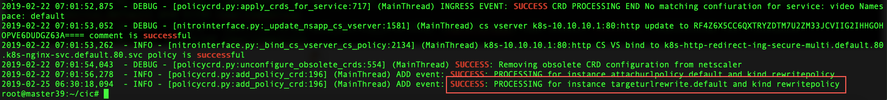

# Using Rewrite and Responder policies in Kubernetes

In kubernetes environment, to deploy specific layer 7 policies to handle scenarios such as, redirecting HTTP traffic to a specific URL, blocking a set of IP addresses to mitigate DDoS attacks, imposing HTTP to HTTPS and so on, requires you to add appropriate libraries within the microservices and manually configure the policies. Instead, you can use the Rewrite and Responder features provided by the Ingress Citrix ADC device to deploy these policies.

Citrix provides Kubernetes [CustomResourceDefinitions](https://kubernetes.io/docs/concepts/extend-kubernetes/api-extension/custom-resources/#customresourcedefinitions) (CRDs) that you can use in conjunction with Citrix Ingress Controller (CIC) and automate the configurations and deployment of these policies on the Citrix ADCs used as Ingress devices.

The Rewrite and Responder CRD provided by Citrix is designed to expose a set of tools used in front-line Citrix ADCs to rewrite the header and payload of ingress and egress HTTP traffic as well as respond to HTTP traffic on behalf of a microservice.

Once you deploy the Rewrite and Responder CRD in the Kubernetes cluster, You can define extensive rewrite and responder policies using datasets, patsets and string maps and also enable audit logs for statistics on the ingress device. For more information on rewrite and responder policy feature provided by Citrix ADC, see [Rewrite policy](https://docs.citrix.com/en-us/citrix-adc/12-1/appexpert/rewrite.html) and [Responder policy](https://docs.citrix.com/en-us/citrix-adc/12-1/appexpert/responder.html).

## Deploying the Citrix CRD

Download the Citrix Rewrite and Responder CRD deployment YAML file, [rewrite-responder-policies-deployment.yaml](../crd/rewrite-responder-policies-deployment.yaml) and deploy it using the following command:

>**Note:**
>
>Ensure that you do not modify the deployment YAML file.

```
root@master:~# kubectl create -f rewrite-responder-policies-deployment.yaml
customresourcedefinition.apiextensions.k8s.io/rewritepolicies.citrix.com created
```

## CRD attributes

The CRD provides attributes for various options required to define the rewrite and responder policies. Also, it provides attributes for dataset, patset, string map, and audit logs to use within the rewrite and responder policies. These CRD attributes corresponds to Citrix ADC command and attribute respectively.

### Rewrite policy

The following table lists the CRD attributes that you can use to define a rewrite policy. Also, the table lists the corresponding Citrix ADC command and attributes.

| **CRD attribute** | **Citrix ADC command** | **Citrix ADC attribute** |
| ----------------- | ---------------------- | ------------------------ |
| rewrite-criteria | Add rewrite policy | rule |
| default-action | Add rewrite policy | undefaction |
| operation | Add rewrite action | type |
| target  | Add rewrite action | target |
| modify-expression | Add rewrite action| stringBuilderExpr |
| multiple-occurence-modify| Add rewrite action| Search |
| additional-multiple-occurence-modify | Add rewrite action | RefineSearch |
| Direction | Bind lb vserver | Type |

### Responder policy

The following table lists the CRD attributes that you can use to define a responder policy. Also, the table lists the corresponding Citrix ADC command and attributes.

| **CRD attribute** | **Citrix ADC command** | **Citrix ADC attribute** |
| ----------------- | ---------------------- | ------------------------ |
| Redirect | Add responder action | Type (the value of type) |
| url | Add responder action | Target |
| redirect-status-code | Add responder action | responseStatusCode |
| redirect-reason | Add responder action | reasonPhrase |
| Respond-with | Add responder action | Type (the value of type) |
| http-payload-string | Add responder action | Target |
| Noop | Add responder policy | Action (the value of action) |
| Reset | Add responder policy | Action (the value of action) |
| Drop | Add responder policy | Action (the value of action) |
| Respond-criteria | Add responder policy | Rule |
| Default-action | Add responder policy | undefAction |

### Audit Log

The following table lists the CRD attributes provide to enable audit log within the rewrite or responder policies. Also, the table lists the corresponding Citrix ADC command and attributes.

| **CRD attribute** | **Citrix ADC command** | **Citrix ADC attribute** |
| ----------------- | ---------------------- | ------------------------ |
| Logexpression | Add audit message action | stringBuilderExpr |
| Loglevel | Add audit message action | Loglevel |

### Dataset

The following table lists the CRD attributes for dataset that you can use within the rewrite or responder policies. Also, the table lists the corresponding Citrix ADC command and attributes.

| **CRD attribute** | **Citrix ADC command** | **Citrix ADC attribute** |
| ----------------- | ---------------------- | ------------------------ |
| Name | Add policy dataset | Name |
| Type  | Add policy dataset |Type |
| Values | Bind policy dataset | Value |

### Patset

| **CRD attribute**  | **Citrix ADC command** | **Citrix ADC attribute** |
| ------------------ | ---------------------- | ------------------------ |
| Name | Add policy patset | Name |
| Values | Bind policy patset | string |

### String Map

| **CRD attribute** | **Citrix ADC command** | **Citrix ADC attribute** |
| ----------------- | ---------------------- | ------------------------ |
| Name | Add policy stringmap | Name |
| Key | Bind policy stringmap | Key |
| Value | Bind policy stringmap | Value |

## How to write a policy configuration

After you have deployed the CRD provided by Citrix in the Kubernetes cluster, you can define the policy configuration in a`.yaml` file. In the `.yaml` file, use `rewritepolicy` in the `kind` field and based on your requirement add any of the following individual sections in `spec` for policy configuration.

-  `rewrite-policy` - To define rewrite policy configuration.
-  `responder-policy` - To define responder policy configuration.
-  `logpackets` - To enable audit logs.
-  `dataset` - To use dataset for extensive policy configuration.
-  `patset` - To use patset for extensive policy configuration.
-  `stringmaps` - To use string maps for extensive policy configuration.

In these sections, you need to use the [CRD attributes](#crd-attributes) provided for respective policy configuration (rewrite or responder) to define the policy.

Also, in the `spec` you need to include a `rewrite-policies` section to specify the service or services to which the policy needs to be applied. For more information, see [Examples](#examples).

After you deploy the `.yaml` file, the Citrix Ingress Controller (CIC) applies the policy configuration on the Ingress Citrix ADC device.

> **Points to note:**
>
> -  If the CRD is associated with a [namespace](https://kubernetes.io/docs/concepts/overview/working-with-objects/namespaces/) then, by default, the policy is applied to the services associated with the namespace. For example, if you have the same service name associated with multiple namespaces then the policy is applied to the service that belongs to the namespace associated with the CRD.
>
> -  If you have defined multiple policies in a single `.yaml` file then the first policy configuration defined in the file takes priority and the subsequent policy configurations is applied as per the sequence. If you have multiple policies defined in different files then the first policy configuration defined in the file that you deployed first takes priority.

Consider a scenario wherein you want to define a policy in Citrix ADC to rewrite all the incoming URLs to `new-url-for-the-application` and send it to the microservices. Create a `.yaml` file called `target-url-rewrite.yaml` and use the appropriate [CRD attributes](#crd-attributes) to define the rewrite policy as shown below:

**target-url-rewrite.yaml:**

```YAML
apiVersion: citrix.com/v1
kind: rewritepolicy
metadata:
  name: targeturlrewrite
spec:
  rewrite-policies:
    - servicenames:
        - citrix-svc
      logpackets:
        logexpression: "http.req.url"
        loglevel: INFORMATIONAL
      rewrite-policy:
        operation: replace
        target: 'http.req.url'
        modify-expression: '"new-url-for-the-application"'
        comment: 'Target URL Rewrite - rewrite the url of the HTTP request'
        direction: REQUEST
        rewrite-criteria: 'http.req.is_valid'
```

After you have defined the policy configuration, deploy the `.yaml` file using the following command:

```
root@master:demo#kubectl create -f target-url-rewrite.yaml
```

After you deploy the `.yaml` file, the Citrix Ingress Controller (CIC) applies the policy configuration on the Ingress Citrix ADC device.

On the master node in the Kubernetes cluster, you can verify if the rewrite policy CRD is created on the CIC using the following command:

```
root@master:~# kubectl logs citrixingresscontroller | grep -i 'SUCCESS\|FAILURE\|exception'
```

You can view an entry in the logs as shown in the below image:



Also, you can verify if the configuration is applied on the Citrix ADC, do the following:

1.  Logon to the Citrix ADC command-line.

1.  Use the following command to verify if the configuration is applied to the Citrix ADC:

    ```
    > show run | grep `lb vserver`
    add lb vserver k8s-citrix.default.80.k8s-citrix-svc.default.http HTTP 0.0.0.0 0 -persistenceType NONE -lbMethod ROUNDROBIN -cltTimeout 180 -comment "uid=67d18ffb-261e-11e9-aad9-8e30e16c8143.ver=1692325"
    bind lb vserver k8s-citrix.default.80.k8s-citrix-svc.default.http k8s-citrix.default.80.k8s-citrix-svc.default.http
    bind lb vserver k8s-citrix.default.80.k8s-citrix-svc.default.http k8s-citrix.default.80.k8s-citrix-svc.default.http -policyname k8s_rwpolicy_crd_targeturlrewrite_0_default_1719072 -priority 1006 -gotoPriorityExpression END -type REQUEST
    ```

    You can verify that the policy `k8s_rwpolicy_crd_targeturlrewrite_0_default_1719072` is bound to the load balancing virtual server.

## Sample policy configurations

### Responder policy configuration

**black-list-urls.yaml:**

```YAML
apiVersion: citrix.com/v1
kind: rewritepolicy
metadata:
  name: blacklisturls
spec:
  responder-policies:
    - servicenames:
        - citrix-svc
      responder-policy:
        respondwith:
          http-payload-string: '"HTTP/1.1 401 Access denied"'
        respond-criteria: 'http.req.url.equals_any("blacklistUrls")'
        comment: 'Blacklist certain Urls'


  patset:
    - name: blacklistUrls
      values:
        - '/app1'
        - '/app2'
        - '/app3'
```

In this example, if Citrix ADC receives any URL that matches the `/app1`, `/app2`, or `/app3` strings defined in the `patset`, Citrix ADC blocks the URL.

### Policy with audit log enabled

**black-list-urls-audit-log.yaml:**

```YAML
apiVersion: citrix.com/v1
kind: rewritepolicy
metadata:
  name: blacklisturls
spec:
  responder-policies:
    - servicenames:
        - citrix-svc
      logpackets:
        logexpression: "http.req.url"
        loglevel: INFORMATIONAL
      responder-policy:
        respondwith:
          http-payload-string: '"HTTP/1.1 401 Access denied"'
        respond-criteria: 'http.req.url.equals_any("blacklistUrls")'
        comment: 'Blacklist certain Urls'


  patset:
    - name: blacklistUrls
      values:
        - '/app1'
        - '/app2'
        - '/app3'
```

### Multiple policy configurations

You can add multiple policy configurations in a single `.yaml` file and apply the policies to the Citrix ADC device. You need add separate sections for each policy configuration.

**multi-policy-config.yaml:**

```YAML
apiVersion: citrix.com/v1
kind: rewritepolicy
metadata:
  name: multipolicy
spec:
  responder-policies:
    - servicenames:
        - citrix-svc
      responder-policy:
        redirect:
          url: '"www.citrix.com"'
        respond-criteria: 'client.ip.src.TYPECAST_text_t.equals_any("redirectIPs")'
        comment: 'Redirect IPs to citrix.com'
    - servicenames:
        - citrix-svc
      responder-policy:
        redirect:
          url: 'HTTP.REQ.HOSTNAME+http.req.url.MAP_STRING_DEFAULT_TO_KEY("modifyurls")'
        respond-criteria: 'http.req.is_valid'
        comment: 'modify specific URLs'

  rewrite-policies:
    - servicenames:
        - citrix-svc
      rewrite-policy:
        operation: insert_http_header
        target: 'sessionID'
        modify-expression: '"48592th42gl24456284536tgt2"'
        comment: 'insert SessionID in header'
        direction: RESPONSE
        rewrite-criteria: 'http.res.is_valid'


  dataset:
    - name: redirectIPs
      type: ipv4
      values:
        - 1.1.1.1
        - 2.2.2.2

  stringmap:
    - name: modifyurls
      comment: Urls to be modified string
      values:
        - key: '"/app1/"'
          value: '"/internal-app1/"'
        - key: '"/app2/"'
          value: '"/internal-app2/"'

````

The example contains two responder policies and a rewrite policy, based on these policies the Citrix ADC device performs the following:

-  Any client request to IP addresses defined in the `redirectIP` dataset, that is, `1.1.1.1` or `2.2.2.2` respectively, the request is redirected to `www.citrix.com`.

-  Any incoming URL with strings provided in the `modifyurls` stringmap is modified to the value provided in the stringmap. For example, if the incoming URL has the string `/app1/` is modified to `/internal-app1/`

-  Adds a sessionID as a new header in the response to the client.

## Related Articles

-  Feature Documentation

    -  [Citrix ADC Rewrite Feature Documentation](https://docs.citrix.com/en-us/citrix-adc/12-1/appexpert/rewrite.html)

    -  [Citrix ADC Responder Feature Documentation](https://docs.citrix.com/en-us/citrix-adc/12-1/appexpert/responder.html)

-  Developer Documentation

    -  [Citrix ADC Rewrite Policy](https://developer-docs.citrix.com/projects/netscaler-command-reference/en/12.0/rewrite/rewrite-policy/rewrite-policy/)

    -  [Citrix ADC Rewrite Action](https://developer-docs.citrix.com/projects/netscaler-command-reference/en/12.0/rewrite/rewrite-action/rewrite-action/)

    -  [Citrix ADC Responder Policy](https://developer-docs.citrix.com/projects/netscaler-command-reference/en/12.0/responder/responder-policy/responder-policy/)

    -  [Citrix ADC Responder Action](https://developer-docs.citrix.com/projects/netscaler-command-reference/en/12.0/responder/responder-action/responder-action/)

    -  [Citrix ADC Audit Message Action](https://developer-docs.citrix.com/projects/netscaler-command-reference/en/latest/audit/audit-messageaction/audit-messageaction/)

    -  [Citrix ADC Policy Dataset](https://docs.citrix.com/en-us/netscaler/12/appexpert/pattern-sets-data-seta/configuring-data-sets.html)
