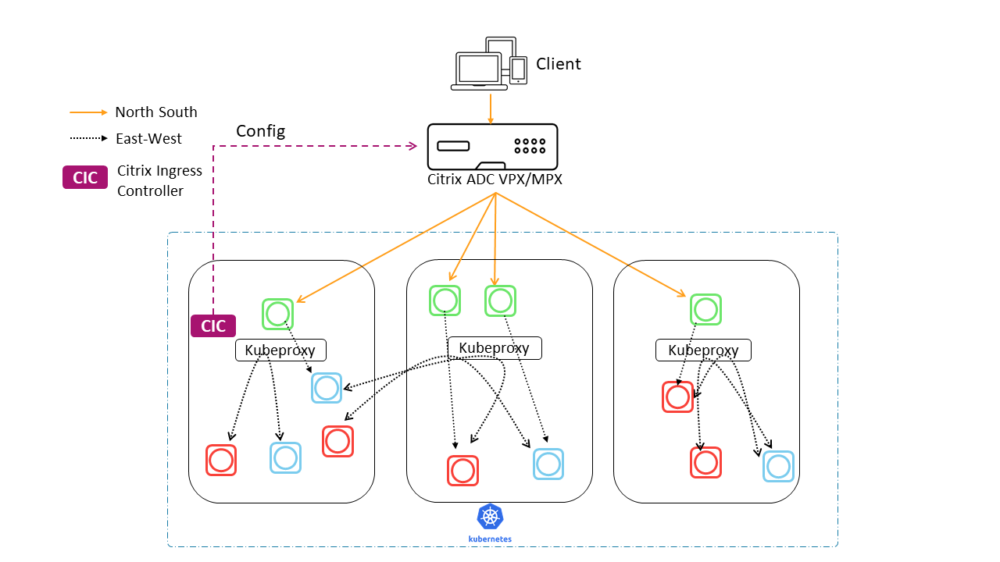

# Single Tier Topology

In Single Tier deployment mode the Tier-1 Citrix ADC directly load balances the frontend microservices.
Citrix ingress Controller automates the configuration of CITRIX ADC(VPX/MPX) with the help of ingress resources which exposes these microservices.
Citrix Ingress Controller is deployed in Kubernetes cluster and manages the configuration of Citrix ADC(VPX/MPX).
Please refer  for features supported.

