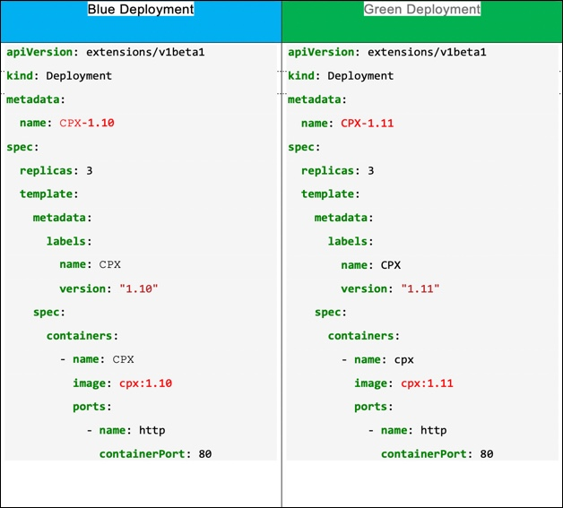
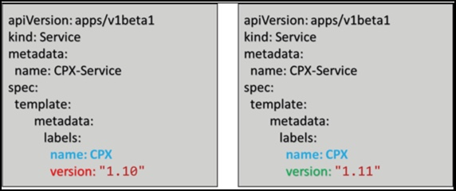
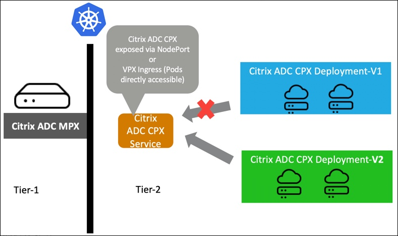

# Upgrading Citrix ADC CPX in a Kubernetes environment

In a cloud native environment, upgrading applications without negatively affecting application reliability or customer experience is challenging.

With infrastructure applications like the Ingress proxy, upgrading is much more difficult. As the proxy sits between ADC and applications, using upgrade strategies like rolling updates may lead to connection disruption for clients. You need to properly plan the upgrade minimize the downtime period.

A proper update strategy is also essential when you need to migrate to a different Citrix ADC proxy.

Citrix ADC CPX upgrade can be performed in two ways:
  
- Rolling deployment
- Blue-green deployment

Rolling deployment is simple and easy to use if there is a provision for downtime. A blue-green deployment does not require any downtime if it is executed well. But for blue-green deployment, you have to additionally create deployment manifests.

## Rolling deployment

The rolling deployment is the standard default deployment in Kubernetes. In rolling deployments, you gradually replace the existing application pods one by one with pods of the new version without any cluster downtime.

For rolling deployment, two Kubernetes probes are used:

- liveness probes to know when to restart a container
- readiness probes to know when a container is ready to start accepting traffic.

A rolling update waits for new pods to become ready via your readiness probe before it starts scaling down the old ones. This strategy is useful when there is a plan for downtime so that the traffic disruption is minimal due to rolling update as the older application pods are deleted by Kubernetes.

The liveness probe also ensures that the new application pod is ready to accept traffic when it is part of the deployment.

Following is a snippet of the sample readiness and liveness configuration.

      containers:
        - name: sample-appliction
          image: application-image:v1

          readinessProbe:
            exec:
              command:
              - ls
            initialDelaySeconds: 60
          livenessProbe:
            exec:
              command:
              - ls
            initialDelaySeconds: 60

## Blue-green deployment

In a blue-green deployment, there are two identical environments. A new copy of the application is deployed alongside the existing version. The old version is named as the blue environment while the new version is known as the green environment. Once the new application is deployed, Ingress, or router to the application is updated to switch to the new version (green). You then need to wait for the old (blue) version to finish the requests sent to it. But, most of the traffic to the application changes to the new version all at once compared to the rolling update where you roll out your application gradually.

Kubernetes natively does not support blue-green deployments. Currently, the best way is creating a deployment and then updating the service for the application to point to the new deployment.  

### Upgrading Citrix ADC CPX using blue-green strategy

**Pre-requites**

- You should have an existing Citrix ADC CPX deployment (blue deployment)
- An existing service pointing to the Citrix ADC CPX deployment

Perform the following steps to upgrade Citrix ADC CPX using the blue-green strategy.

1. Create a manifest file for deploying Citrix ADC CPX with the new version as the green deployment.

   The following diagram shows sample YAML files for a blue and a green deployment.

   

2. Deploy the green deployment of the Citrix ADC CPX.

3. To send the traffic to `green` deployment, update the label selector for the service. The new Citrix ADC CPX version is ready to take the traffic.

   The following diagram shows an updated label selector.
  
   

4. Monitor the traffic for the old Citrix ADC CPX version (for example: 1.10) using any monitoring system as the old Citrix ADC CPX continues to service the existing connection.

  Once the existing connections are served and no further connections are pending, Kubernetes deletes the old Citrix ADC CPX deployment.

The following diagram shows a blue-green deployment for Citrix ADC CPX.

  