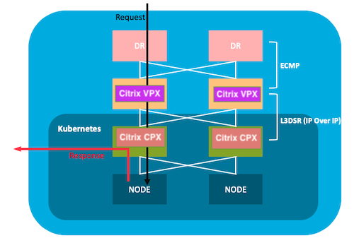
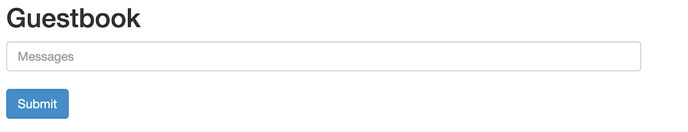

# Table of contents
1. [Introduction](#introduction)
2. [When to use DSR architecture?](#when)
3. [Who should read this?](#who)
4. [DSR Network Topology and Traffic flow](#topology)
5. [DSR Configuration for cloud-native apps using Citrix ADC](#conf)
	1. [Tier-2 Configurations](#ingress)
	2. [Deploying Application on Kubernetes Cluster](#application)
	3. [Establish Network connectivity between Tier-1 and Tier-2](#cnc)
	4. [Tier-1 Configurations](#adc)
	5. [Test the Deployment](#test)
6. [Misc](#misc)

# **Introduction**
DSR is a method  of asymmetric network load distribution in load-balanced systems, where request and response have different network paths.
The use of different network paths helps avoid extra hops and reduces the latency by which not only speeds up the response time between the client and the service but also removes some extra load from the load balancer. Using DSR is a transparent way to achieve increased network performance for your applications with little to no infrastructure changes.

Some of the pros and cons of DSR mode of topologies are,

**Pros**

1. Very fast load-balancing mode
2. Load-balancer network bandwidth is not a bottleneck anymore
3. Total output bandwidth is the sum of each backend bandwidth
4. Less intrusive than the layer 4 load-balancing NAT mode

**Cons**

1. No layer 7 advanced features are available

<a name="when"></a>
# **When use DSR architecture?**

1. Where response time matters. Example, video streaming.
2. Where no intelligence is required
3. When the output capacity of the load-balancer could be the bottleneck

<a name="who"></a>
# **Who should read this?**

1. Who wants the DSR solution for the Kubernetes platform.

<a name="topology"></a>
# **DSR Network Topology and Traffic Flow**

There is an external load-balancer that distributes the traffic to the ingress controller on the Kubernetes via an overlay (L3 DSR IPIP). Ingress controller picks up the packet, decapsulate the packet and does load balancing among the services. When return traffic comes from service which will be directly sent to the client instead of via ADC.


<a name="conf"></a>
# **DSR Configuration for cloud native apps using Citrix ADC**

This section provides step by step guide to deploy the Application for Direct Server Return using Citrix ADC.

<a name="ingress"></a>
## **1. Tier-2 Configurations.**

This section helps to create configurations required on the ingress device for DSR topology.

- ### **Create a namespace  for DSR.**

	This creates a namespace called ```dsr```.

	```
	kubectl apply -f  https://raw.githubusercontent.com/citrix/citrix-k8s-ingress-controller/master/example/dsr/KubernetesConfig/dsr_namespace.yaml
	```

- ### **Create a Configmap.**

	```
	kubectl apply -f  https://raw.githubusercontent.com/citrix/citrix-k8s-ingress-controller/master/example/dsr/KubernetesConfig/cpx_config.yaml  -n dsr
	```

- ### **Deploy Citrix CPX ingress controller.**

	Deploy Citrix ADC CPX on namespace ```dsr```.
	```
	kubectl apply -f https://raw.githubusercontent.com/citrix/citrix-k8s-ingress-controller/master/example/dsr/KubernetesConfig/citrix-k8s-cpx-ingress.yml  -n dsr
	```

<a name="application"></a>
## **2. Deploying Application on Kubernetes Cluster**

- ### **Deploy the Guestbook application.**

	```
	  kubectl apply -f https://raw.githubusercontent.com/citrix/citrix-k8s-ingress-controller/master/example/dsr/KubernetesConfig/guestbook-all-in-one.yaml  -n dsr 
	```
- ### **Expose the guestbook application using ingress.**

	Download the guestbook ingress yaml.
	```
	wget https://raw.githubusercontent.com/citrix/citrix-k8s-ingress-controller/master/example/dsr/KubernetesConfig/guestbook-all-in-one.yaml
	```
	provide the DSR IP/Public IP through which user access your application via ```ingress.citrix.com/frontend-ip:``` annotations.
	```
     	kubectl apply -f guestbook-ingress.yaml -n dsr
	```

<a name="cnc"></a>
## **3. Establish Network connectivity between Tier-1 and Tier-2**

- ## **Download the CitrixNodeController yaml**
	```
	wget https://raw.githubusercontent.com/citrix/citrix-k8s-node-controller/master/deploy/citrix-k8s-node-controller.yaml
	```
- ## **Provide Input for CitrixNodeController**
	Provide NS_IP, NS_USER, NS_PASSWORD and REMOTE_VTEPIP arguments. Please refer [here](https://github.com/citrix/citrix-k8s-node-controller) for more detailed information.
- ## **Deploy the CitrixNodeController**
	```
           kubectl create -f citrix-k8s-node-controller.yaml -n dsr
	```

<a name="adc"></a>
## **4. Tier-1 Configurations**
   
- ## **Download the Citrix Ingress Controller yaml**

      ```
          wget https://raw.githubusercontent.com/citrix/citrix-k8s-ingress-controller/master/example/dsr/KubernetesConfig/citrix-k8s-ingress-controller.yaml
      ```

- ## **Provide following Input for Citrix Ingress Controller**

	Provide NS_IP, NS_USER and NS_PASSWORD arguments. Please refer [here](https://github.com/citrix/citrix-k8s-ingress-controller) for more detailed information.

- ## **Deploy the Citrix Ingress Controller**

	```
           kubectl create -f citrix-k8s-ingress-controller.yaml -n dsr
	```

- ## **Create ingress for CPX-Service**

   Create DSR configuration on Tier-1 ADC by creating ingress resource for the tier-2 cpx. 
	```
	wget https://raw.githubusercontent.com/citrix/citrix-k8s-ingress-controller/master/example/dsr/KubernetesConfig/vpx-ingress.yaml 
	```
	provide the DSR IP/Public IP through which user access your application via ```ingress.citrix.com/frontend-ip:``` annotations. This must be same as what we have given on step 2.
	```
     	kubectl apply -f vpx-ingress.yaml  -n dsr
	```

<a name="test"></a>
## **5. Test the Deployment**
Access the application from a browser using the IP given for ```ingress.citrix.com/frontend-ip:```. A guestbook page will be populated. Sample output is given below. 


<a name="misc"></a>
# Misc
When you test the application, it might not populate any pages, even though all required configurations are created. This is because of ```rp_filter``` rules on the host. If you face any such issue, please enable the following on all the hosts.
```
sysctl -w net.ipv4.conf.all.rp_filter=0
sysctl -w net.ipv4.conf.cni0.rp_filter=0
sysctl -w net.ipv4.conf.eth0.rp_filter=0
sysctl -w net.ipv4.conf.cni0.rp_filter=0
sysctl -w net.ipv4.conf.default.rp_filter=0
```


