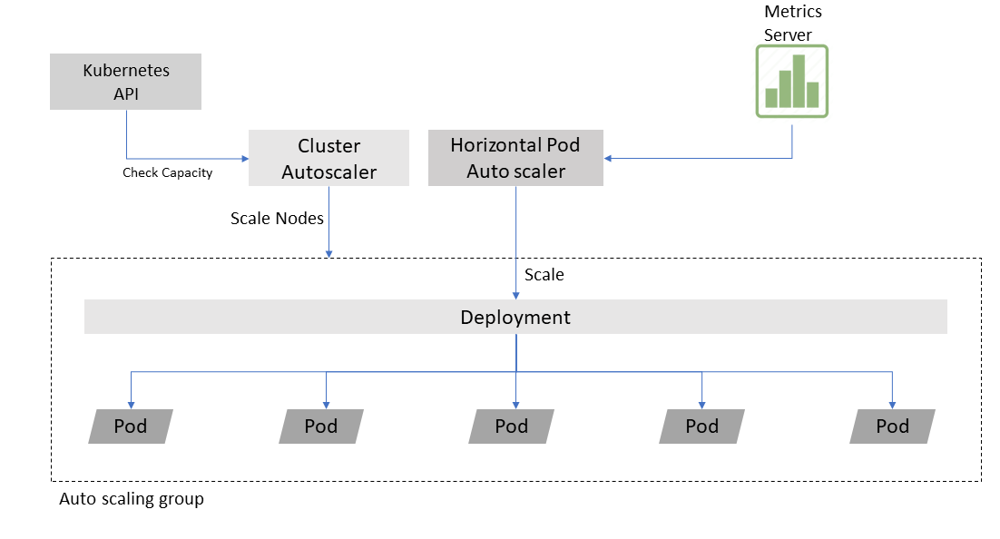
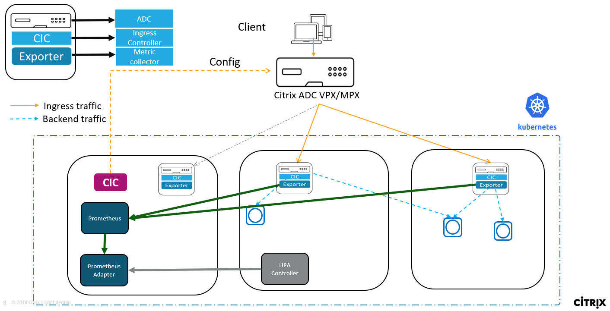
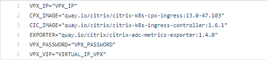
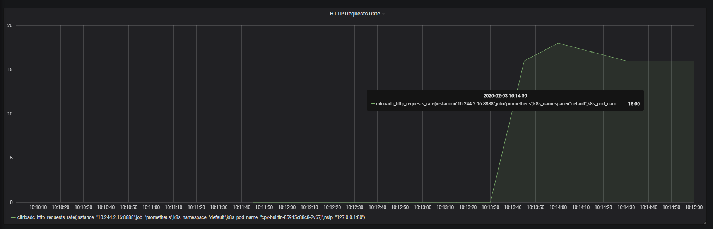
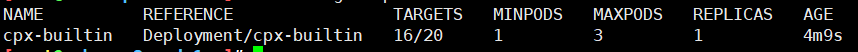
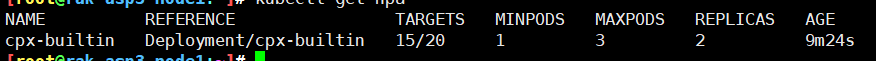
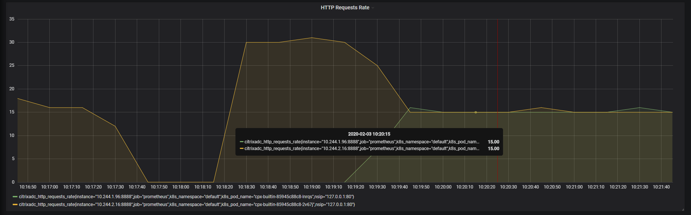

# **CPX HPA with Custom metrics**
## Kubernetes Autoscaling: Horizontal Pod Autoscaler(HPA)
* Horizontal Pod Autoscaler is a resource provided by Kubernetes which as the name implies, scales Kubernetes based resources like deployments, replica sets and replication controllers.
* Traditionally HPA gets its metrics from metrics-server. It then periodically adjusts the number of replicas in a deployment to match the observed average metrics to the target specified by user.

<p align="center">

Figure 1. HPA with traditional metrics-server
</p>

## Why custom metrics for Citrix ADC CPX?
By default, the metrics-server only gives CPU and memory metrics for a pod. To take a better autoscaling judgement based on rich set of counters as provided by Citrix ADC a custom metric based HPA is a better solution like Autoscaling based upon HTTP request or SSL transactions or ADC bandwidth.

## Components being used:
#### Citrix ADC VPX
VPX is present in Tier-1 and load balancing the client requests among the CPX pods in the CPX deployment present in the cluster.
#### Citrix ADC CPX
CPX is acting as a load balancer in Tier-2 for the endpoint application pods.
The CPX pod is running with CIC and Exporter in sidecar.
#### Citrix Ingress Controller (CIC)
CIC is an ingress controller which is built around Kubernetes Ingress and automatically configures Citrix ADC based on the Ingress resource configuration. It can be found [here](https://github.com/citrix/citrix-k8s-ingress-controller).

There are 2 types of CICs in Figure 2 below. One is used for configuring the VPX and the other one for configuring the CPX where it is running as a sidecar container.
#### Exporter
The Exporter is a sidecar container which is exposing the CPX's metrics. Exporter collects the metrics from CPX and exposes it in a format that Prometheus can understand.
Citrix ADC Metrics Exporter can be found [here](https://github.com/citrix/citrix-adc-metrics-exporter).
#### Prometheus
Prometheus – which is a graduated CNCF project – is used to collect all the metrics from the CPX and expose them using Prometheus-adapter which will be queried by the HPA controller to keep a check on the metrics.
#### Prometheus-adapter
Prometheus-adapter contains an implementation of the Kubernetes resource metrics API and custom metrics API. This adapter is therefore suitable for use with the autoscaling/v2 Horizontal Pod Autoscaler in Kubernetes 1.6+. It can also replace the metrics server on clusters that already run Prometheus and collect the appropriate metrics.

Below, Figure 2, is a visual representation of how an HPA works. A 2-tier model with VPX which is load balancing the CPX deployment is present. The CPXs are in turn load balancing the applications. A Prometheus, Prometheus-adapter and an HPA controller for the CPX deployment are also deployed.
The HPA controller will keep polling the Prometheus-adapter for custom metrics like HTTP requests rate or Bandwidth. Whenever the limit defined by the user in the HPA is reached, it would scale the CPX deployment and create another CPX pod to handle the load.

<p align="center">

Figure 2. Visual representation of CPX autoscaling with custom metrics from Prometheus-adapter
</p>

## Steps to deploy HPA:

### Step 1: Clone repo and change directory
Clone the citrix-k8s-ingress-controller repository from Github using the following command.

```git clone https://github.com/citrix/citrix-k8s-ingress-controller.git```

After cloning, go to the examples folder with the following command.

```cd citrix-k8s-ingress-controller/blob/master/example/hpa-demo/```

### Step 2: Set values for VPX



Open ```values.sh``` in the current directory and update the values on the right-hand side of ```VPX_IP```, ```VPX_PASSWORD``` and ```VIRTUAL_IP_VPX```. ```VPX_IP``` will be the IP of the VPX that will be used. ```VPX_PASSWORD``` will be the password of the "nsroot" user on VPX. Finally, ```VIRTUAL_IP_VPX``` will be the IP on which the guesbook application(This is a dummy application that is being used for demo purposes.) will be accessced. 

### Step 3: Create all the resources
After the values.sh file is set. Create all the resources by just running the ```create_all.sh``` file. This will create all the resources like Prometheus and Grafana for monitoring, CPX deployment (CPX with CIC and Exporter as sidecars), CIC pod for the VPX, ingresses for both CPX and VPX, guestbook application and CPX HPA for monitoring the CPX deployment. Finally, the Prometheus-adapter helm chart will be installed for exposing the custom metrics which is getting collected in the Prometheus.

Execute ```./create_all.sh```

### Step 4: Add an entry in the hosts file
Route needs to be added in the hosts file in order to route traffic for http://www.guestbook.com application to the VPX Virtual IP that was set in the 2nd step.
For most Linux distros, the ```hosts``` file is present in ```/etc``` folder.

### Step 5: Send traffic and see the CPX deployment autoscale
The CPX deployment HPA has been configured in such a way that when the average "HTTP requests rate" of the CPX goes above 20, it will autoscale.
There are two shell scripts in the folder. One for sending traffic below the threshold and one for sending traffic above the threshold. All this can be visualized in Grafana dashboard as shown in Figure 3 and Figure 5.

Run the ```16_curl.sh``` script to send 16 HTTP requests per second to the CPX. 

<p align="center">

Figure 3. Grafana dashboard when 16 HTTP requests are sent per second.
</p>
<p align="center">

Figure 4. HPA state with 16 RPS (requests per second)
</p>

Now, run the ```30_curl.sh``` script to send 30 requests per second to the CPX. In this the threshold of 20 that was set has been crossed and the CPX deployment has autoscaled from 1 pod to 2 pods. The average value of the metric "HTTP request rate" has also gone down from 30 to 15 in Figure 6 because there are 2 CPX pods now.
 
<p align="center">

Figure 5. State of HPA when the average target is overshoot.
</p>
 
<p align="center">

Figure 6. The number of replicas has gone up from 1 to 2 and the average is 15 RPS
</p>

<p align="center">

Figure 7. Grafana dashboard with 2 CPXs load balancing the traffic.
</p>


### Step 6: Clean up
Clean up by just executing the ```delete_all.sh``` script.

Execute ```./delete_all.sh```

## NOTE
If Tier-1 VPX is not present use [Nodeport](https://kubernetes.io/docs/concepts/services-networking/service/#nodeport) to expose the CPX service.