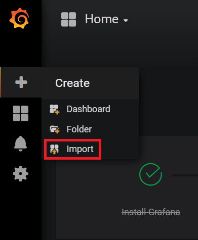

Metrics Visualization of Citrix ADC Appliances in Kubernetes
===

This document describes how the [Citrix ADC Metrics Exporter](https://github.com/citrix/citrix-adc-metrics-exporter) and [Prometheus-Operator](https://github.com/coreos/prometheus-operator) can be used to auto-detect and monitor VPX/CPX ingress devices and CPX-EW (east-west) devices. Moitoring dashboards setup for detected devices will be brought up as Grafana dashboard.


Launching Promethus-Operator
---
Prometheus Operator has an expansive method of monitoring services on Kubernetes. It makes use ServiceMonitors defined by CRDs to automatically detect services and their corresponding pod endpoints. To get started a basic working model, this guide makes use of [kube-prometheus](https://github.com/coreos/prometheus-operator/tree/master/contrib/kube-prometheus).
```
git clone https://github.com/coreos/kube-prometheus.git
kubectl create -f kube-prometheus/manifests/setup/
kubectl create -f kube-prometheus/manifests/
```
This creates several pods and services, of which ```prometheus-k8s-xx``` pods aggregate and timestamp metrics collected from NetScaler devices, and the ```grafana``` pod can be used for visualization. An output similar to this should be seen:
```
$ kubectl get pods -n monitoring
NAME                                   READY     STATUS    RESTARTS   AGE
alertmanager-main-0                    2/2       Running   0          2h
alertmanager-main-1                    2/2       Running   0          2h
alertmanager-main-2                    2/2       Running   0          2h
grafana-5b68464b84-5fvxq               1/1       Running   0          2h
kube-state-metrics-6588b6b755-d6ftg    4/4       Running   0          2h
node-exporter-4hbcp                    2/2       Running   0          2h
node-exporter-kn9dg                    2/2       Running   0          2h
node-exporter-tpxhp                    2/2       Running   0          2h
prometheus-k8s-0                       3/3       Running   1          2h
prometheus-k8s-1                       3/3       Running   1          2h
prometheus-operator-7d9fd546c4-m8t7v   1/1       Running   0          2h
```

**NOTE:** The files in the ```manifests/``` folder have interdependencies due to which the order in which they get created is important. At times the manifest files may get created out of order leading to ```Error``` messages from Kubernetes. To resolve this, simply re-run the ```kubectl create -f kube-prometheus/manifests/``` command. Any yaml files that had not been created the first time around due to unmet dependencies, will get created this time.

It may be preferable to expose the Prometheus and Grafana pods via NodePorts. To do so, the prometheus-service.yaml and grafana-service.yaml files will need to be modified as follows:


<details>
<summary>prometheus-service.yaml</summary>
<br>

```
apiVersion: v1
kind: Service
metadata:
  labels:
    prometheus: k8s
  name: prometheus-k8s
  namespace: monitoring
spec:
  type: NodePort
  ports:
  - name: web
    port: 9090
    targetPort: web
  selector:
    app: prometheus
    prometheus: k8s
```

</details>


<details>
<summary>grafana-service.yaml</summary>
<br>

```
apiVersion: v1
kind: Service
metadata:
  name: grafana
  namespace: monitoring
spec:
  type: NodePort
  ports:
  - name: http
    port: 3000
    targetPort: http
  selector:
    app: grafana
```

</details>


To apply these changes into the kubernetes cluseter run:
```
kubectl apply -f prometheus-service.yaml
kubectl apply -f grafana-service.yaml
```

Configuring Citrix ADC Metrics Exporter
---
This section describes how to integrate the Citrix ADC Metrics Exporter with the VPX/CPX ingress or CPX-EW devices. 

<details>
<summary>VPX Ingress Device</summary>
<br>

To monitor an ingress VPX device, the citrix-adc-metrics-exporter will be run as a pod within the kubernetes cluster. The IP of the VPX ingress device will be provided as an argument to the exporter. 
To provide the login credentials to access ADC, create a secret and mount the volume at mountpath "/mnt/nslogin".
```
kubectl create secret generic nslogin --from-literal=username=<citrix-adc-user> --from-literal=password=<citrix-adc-password> -n <namespace>
```

An example yaml file to deploy such an exporter is given below:

```
apiVersion: v1
kind: Pod
metadata:
  name: exporter-vpx-ingress
  labels:
    app: exporter-vpx-ingress
spec:
  containers:
    - name: exporter
      image: "quay.io/citrix/citrix-adc-metrics-exporter:1.4.8"
      imagePullPolicy: Always
      args:
        - "--target-nsip=<IP_of_VPX>"
        - "--port=8888"
      volumeMounts:
      - name: nslogin
        mountPath: "/mnt/nslogin"
        readOnly: true
      securityContext:
        readOnlyRootFilesystem: true
  volumes:
  - name: nslogin
    secret:
      secretName: nslogin
---
apiVersion: v1
kind: Service
metadata:
  name: exporter-vpx-ingress
  labels:
    app: exporter-vpx-ingress
    service-type: citrix-adc-monitor
spec:
  type: NodePort
  ports:
    - name: exporter-port
      port: 8888
      targetPort: 8888
  selector:
    app: exporter-vpx-ingress
    
```
The IP and port of the VPX device needs to be filled in as the ```--target-nsip``` (Eg. ```--target-nsip=10.0.0.20```). 
</details>

<details>
<summary>CPX Ingress Device</summary>
<br>
  
To monitor a CPX ingress device, the exporter is added as a side-car.An example yaml file of a CPX ingress device with an exporter as a side car is given below;
```
---
apiVersion: extensions/v1beta1
kind: Deployment
metadata:
  name: cpx-ingress
  labels:
    app: cpx-ingress
spec:
  replicas: 1
  selector:
    matchLabels:
      app: cpx-ingress
  template:
    metadata:
      labels:
        app: cpx-ingress
      annotations:
        NETSCALER_AS_APP: "True"
    spec:
      serviceAccountName: cpx
      containers:
        # Adding exporter as a side-car
        - name: exporter
          image: "quay.io/citrix/citrix-adc-metrics-exporter:1.4.8"
          imagePullPolicy: Always
          args:
            - "--target-nsip=127.0.0.1"
            - "--port=8888"
            - "--secure=no"
          env:
          - name: "NS_USER"
            value: "nsroot"
          - name: "NS_PASSWORD"
            value: "nsroot"
          securityContext:
            readOnlyRootFilesystem: true
        - name: cpx-ingress
          image: "quay.io/citrix/citrix-k8s-cpx-ingress:13.0-52.24"
          imagePullPolicy: Always
          securityContext:
            privileged: true
          env:
            - name: "EULA"
              value: "YES"
            - name: "NS_PROTOCOL"
              value: "HTTP"
            #Define the NITRO port here
            - name: "NS_PORT"
              value: "9080"
          ports:
            - name: http
              containerPort: 80
            - name: https
              containerPort: 443
            - name: nitro-http
              containerPort: 9080
---
apiVersion: v1
kind: Service
metadata:
  name: exporter-cpx-ingress
  labels:
    app: exporter-cpx-ingress
    service-type: citrix-adc-monitor
spec:
  selector:
    app: cpx-ingress
  ports:
    - name: exporter-port
      port: 8888
      targetPort: 8888
```
Here, the exporter uses the ```127.0.0.1``` local IP to fetch metrics from the CPX.

</details>


<details>
<summary>CPX-EW Device</summary>
<br>

To monitor a CPX-EW (east-west) device, the exporter is added as a side-car. An example yaml file of a CPX-EW device with an exporter as a side car is given below;
```
apiVersion: extensions/v1beta1
kind: DaemonSet
metadata:
  name: cpx-ew
spec:
  template:
    metadata:
      name: cpx-ew
      labels:
        app: cpx-ew
      annotations:
        NETSCALER_AS_APP: "True"
    spec:
      serviceAccountName: cpx
      hostNetwork: true
      containers:
        - name: cpx
          image: "quay.io/citrix/citrix-k8s-cpx-ingress:13.0-52.24"
          securityContext: 
             privileged: true
          env:
          - name: "EULA"
            value: "yes"
          - name: "NS_NETMODE"
            value: "HOST"
          #- name: "kubernetes_url"
          #  value: "https://10..xx.xx:6443"
        # Add exporter as a sidecar
        - name: exporter
          image: "quay.io/citrix/citrix-adc-metrics-exporter:1.4.8"
          args:
            - "--target-nsip=192.168.0.2"
            - "--port=8888"
            - "--secure=no"
          env:
          - name: "NS_USER"
            value: "nsroot"
          - name: "NS_PASSWORD"
            value: "nsroot"
          imagePullPolicy: Always
          securityContext:
            readOnlyRootFilesystem: true
---
apiVersion: v1
kind: Service
metadata:
  name: exporter-cpx-ew
  labels:
    app: exporter-cpx-ew
    service-type: citrix-adc-monitor
spec:
  selector:
    app: cpx-ew
  ports:
    - name: exporter-port
      port: 8888
      targetPort: 8888
```
Here, the exporter uses the ```192.168.0.2``` local IP to fetch metrics from the CPX.

</details>


ServiceMonitors to Detect NetScalers
---
Till this point, Citrix ADC Metrics Exporters were setup to collect data from the VPX/CPX ingress and CPX-EW devices. Now, these Exporters needs to be detected by Prometheus Operator so that the metrics which are collected can be timestamped, stored, and exposed for visualization on Grafana. Prometheus Operator uses the concept of ```ServiceMonitors``` to detect pods belonging to a service, using the labels attached to that service. 

The following example file will detect all the Exporter endpoints associated with Exporter services which have the label ```service-type: citrix-adc-monitor``` associated with them.

```
apiVersion: monitoring.coreos.com/v1
kind: ServiceMonitor
metadata:
  name: citrix-adc-servicemonitor
  labels:
    servicemonitor: citrix-adc
spec:
  endpoints:
  - interval: 30s
    port: exporter-port
  selector:
    matchLabels:
      service-type: citrix-adc-monitor
  namespaceSelector:
    matchNames:
    - monitoring
    - default
```

The above ```serviceMonitor``` directs Prometehus to detect Exporters in the ```default``` and ```monitoring``` namespaces only. To detect Exporters from other namespaces add the names of those namespaces under the ```namespaceSelector:```.

**NOTE:** If the Exporter to be monitored exists in a namespace other than the ```default``` or ```monitoring``` namespace, then additional rbac privilages will need to be provided to Promehtheus to access those namespaces. An example yaml file providing Promtheus full access to resources across namespaces is provided below:

<details>
<summary>prometheus-clusterRole.yaml</summary>
<br>

```
apiVersion: rbac.authorization.k8s.io/v1
kind: ClusterRole
metadata:
  name: prometheus-k8s
rules:
- apiGroups:
  - ""
  resources:
  - nodes/metrics
  - namespaces
  - services
  - endpoints
  - pods
  verbs: ["*"]
- nonResourceURLs:
  - /metrics
  verbs:  ["*"]
```

</details>


To provide these additional privilages, run ```kubectl apply -f prometheus-clusterRole.yaml```.

Visualization of Metrics
---
The NetScaler instances which were detected for monitoring will appear in the ```Targets``` page of the prometheus container. It canbe accessed using ```http://<k8s_cluster_ip>:<prometheus_nodeport>/targets``` and will look similar to the screenshot below


To view the metrics graphically,
1. Log into grafana using ```http://<k8s_cluster_ip>:<grafana_nodeport>``` with default credentials ```admin:admin```

2. Import [k8s ingress services grafana dashboard](https://github.com/citrix/citrix-adc-metrics-exporter/blob/master/k8s_cic_ingress_service_stats.json) or [sampe system grafana dashboard](https://github.com/citrix/citrix-adc-metrics-exporter/blob/master/sample_system_stats.json) by selecting the ```+``` icon on the left panel and clicking import.



3. A dashboard containing graphs similar to any of these following should appear

 

4. The dashboard can be further enhanced using Grafana's [documentation](http://docs.grafana.org/) or demo [videos](https://www.youtube.com/watch?v=mgcJPREl3CU).

