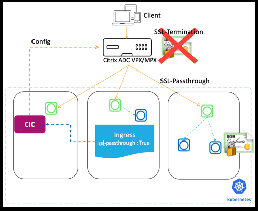

# SSL Passthrough

SSL passthrough feature allows you to pass incoming security sockets layer (SSL) requests directly to a server for decryption rather than decrypting the request using a load balancer. SSL passthrough is widely used for web application security and it uses the TCP mode to pass encrypted data to servers.

The proxy SSL passthrough configuration does not require the installation of an SSL certificate on the load balancer. SSL certificates are installed on the back end server as they handle the SSL connection instead of the load balancer.

The following diagram explains the SSL passthrough feature.



As shown in this diagram, SSL traffic is not terminated at the NetScaler and SSL traffic is passed through the NetScaler to the back end server. SSL certificate at the back end server is used for the SSL handshake.

The Netscaler ingress controller provides the following Ingress annotation that you can use to enable SSL passthrough on the Ingress NetScaler:

    ingress.citrix.com/ssl-passthrough: 'True|False'

The default value of the annotation is `False`.

SSL passthrough is enabled for all services or host names provided in the Ingress definition. SSL passthrough uses host name (wildcard host name is also supported) and ignores paths given in Ingress.

**Note:** The Netscaler ingress controller does not support SSL passthrough for non-hostname based Ingress. Also, SSL passthrough is not valid for default back end Ingress.

To configure SSL passthrough on the Ingress NetScaler, you must define the `ingress.citrix.com/ssl-passthrough:` as shown in the following sample Ingress definition. You must also enable TLS for the host as shown in the example.

```
apiVersion: networking.k8s.io/v1
kind: Ingress
metadata:
  annotations:
    ingress.citrix.com/insecure-termination: redirect
    ingress.citrix.com/secure-backend: 'True'
    ingress.citrix.com/ssl-passthrough: 'True'
  name: ssl-passthrough-example
spec:
  ingressClassName: netscaler
  rules:
  - host: www.exampletest.com
    http: null
    paths:
    - backend:
        path: /
        pathType: Prefix
        service:
          name: example-test
          number: 443
          port: null
  tls:
  - secretName: tls-example-test
---
apiVersion: networking.k8s.io/v1
kind: IngressClass
metadata:
  name: netscaler
spec:
  controller: citrix.com/ingress-controller
---
```

